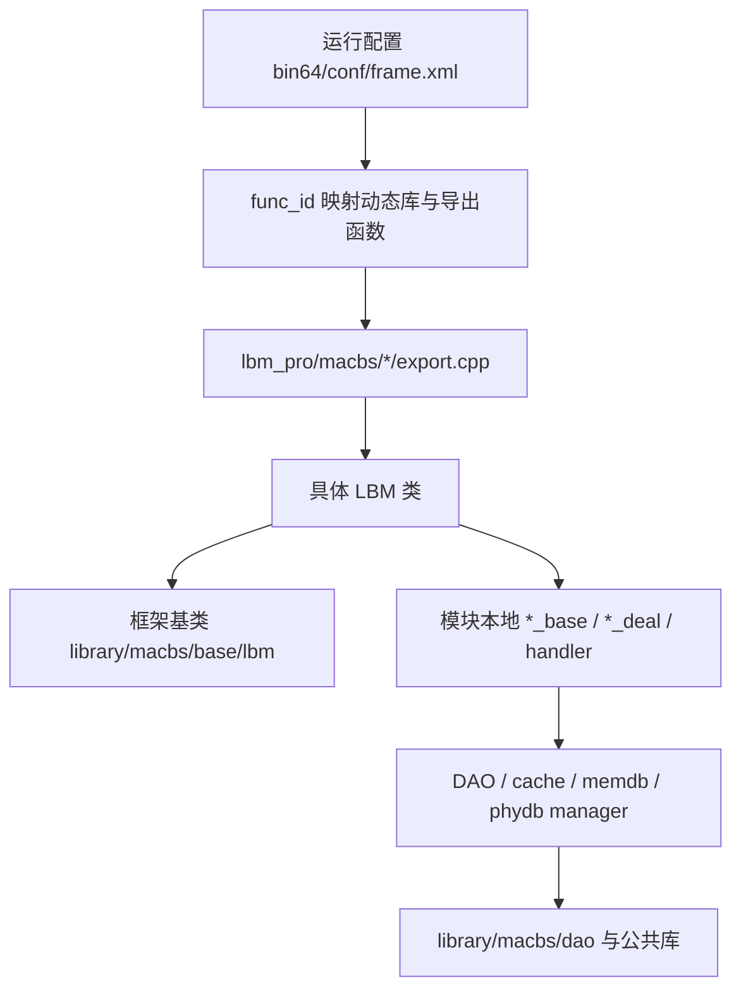
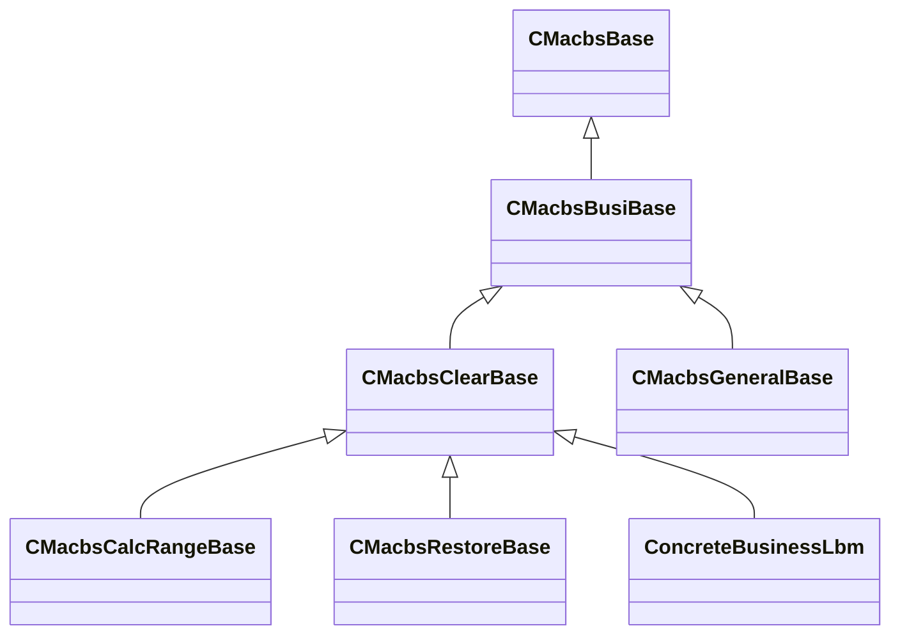
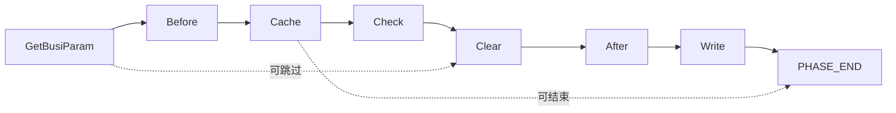

# macbs-base 二次开发知识库

> 适用范围：`macbs-base/` 代码结构、框架执行模型、模块定位、二次开发落点。本文基于当前仓库源码梳理，优先引用真实入口文件。

## 1. 总体架构

`macbs-base` 是“公共框架 + 多个业务动态库模块 + 客户项目定制”的 C++ 代码库。



核心结论：

- `library/macbs/` 是共享框架层，定义 LBM 基类、handler 基类、工厂、manager、DAO/table 工具。
- `lbm_pro/macbs/` 是业务实现层，按清算、记账、费用、报表、对账单等业务阶段拆成多个动态库。
- `lbm_pro/macbs/project/` 是券商/客户定制层，用于替换或扩展公共模块行为。
- 顶层 `CMakeLists.txt` 统一编译选项、include 路径、链接库、输出目录，并通过 `add_subdirectory(...)` 纳入各公共库和业务模块。

## 2. 顶层目录职责

| 路径 | 职责 | 二次开发关注点 |
|---|---|---|
| `CMakeLists.txt` | 顶层构建入口；配置编译标准、include、link、输出目录、子模块 | 新模块接入、构建依赖调整 |
| `CMakePresets.json` | CMake preset 配置 | 本地构建环境选择 |
| `compile_commands.json` | 编译数据库 | 代码索引、静态分析 |
| `bin64/` | 运行配置、运行时产物、动态库输出目录 | `frame.xml` 映射 func_id |
| `cmake/` | 构建宏和工具脚本 | 构建规则、版本扫描、优化选项 |
| `library/` | 公共框架、公共库、DAO、工具库、第三方依赖封装 | 框架级扩展和公共能力 |
| `lbm_pro/` | 业务 LBM 模块源码 | 绝大多数业务需求修改点 |
| `patch/` | 补丁相关内容 | 版本交付/差异管理 |
| `pre-commit/` | 提交前检查脚本 | 提交流程质量控制 |

## 3. 构建与产物模型

顶层构建入口：`CMakeLists.txt`。

重要行为：

- 输出目录：`bin64/function_${DBTYPE}_${CMAKE_BUILD_TYPE}`
- 全局 include 覆盖：`library/macbs/base/`、`factory/`、`handler/`、`lbm/`、`manager/`、`include/`、`comm/`、`dao/` 等。
- 公共库先构建：`library/macbs/lib/*`、`library/macbs/util/*`。
- 业务模块通过 `add_subdirectory("lbm_pro/macbs/...")` 接入，每个模块通常编译成独立 DLL/SO。

已纳入顶层构建的业务模块包括：

- 示例/测试/系统：`cbs_example`、`cbs_test`、`cbs_file`、`cbs_file_analysis`、`cbs_sys`、`cbs_memdb_sync`、`cbs_service`
- 清算前后链路：`cbs_day_clear_adapter`、`cbs_market_data_deal`、`cbs_preclear`、`cbs_preclear_order`、`cbs_preclear_fund`、`cbs_clear_match`、`cbs_clear`、`cbs_after_clear`
- 记账链路：`cbs_before_book`、`cbs_book`、`cbs_after_book`
- 费用/成本链路：`cbs_fee`、`cbs_after_fee`、`cbs_fund_cost`、`cbs_after_fund_cost`
- 业务处理/检查：`cbs_interest_deal`、`cbs_rzrq_deal`、`cbs_china_clear_check`、`cbs_other_check`、`cbs_assistcheck`、`cbs_close`
- 汇总/输出：`cbs_asset_calculate`、`cbs_data_summary`、`cbs_report`、`cbs_dzd`
- 项目定制：`project/guoxin/cbs_dzd`、`project/guoxin/cbs_ssf`、`project/guoxin/cbs_china_clear_check`、`project/guoxin/cbs_axb`、`project/huaxing/cbs_report`

## 4. 运行入口：func_id 到代码的链路

运行入口链路：

```mermaid
sequenceDiagram
    participant Frame as bin64/conf/frame*.xml
    participant Loader as LBM运行框架
    participant Export as export.cpp导出函数
    participant Obj as 具体业务类
    participant Base as CMacbsClearBase/其他基类

    Frame->>Loader: func_id, module, path
    Loader->>Export: 调用导出函数，如 DoClearBusiness(char* pCA)
    Export->>Obj: CLASS obj; obj.Init(pCA,...)
    Export->>Obj: obj.DoClear() / obj.FUNC()
    Obj->>Base: 进入基类固化流程
```

关键文件：

- `bin64/conf/frame.xml`：Linux/通用运行配置。
- `lbm_pro/macbs/<module>/export.cpp`：模块导出函数与具体类绑定。
- `library/macbs/include/macbs_exportdef.h`：`MACBS_LBM_API`、`MACBS_CLEAR_LBM_API` 等导出宏。

分析某个 `func_id` 时按此顺序：

1. `bin64/conf/frame.xml`。
2. 确认 `func_id` 对应的 `module`、动态库路径、导出函数名。
3. 打开对应模块 `export.cpp`，看导出函数绑定哪个 C++ 类和哪个方法。
4. 打开具体类头/源文件，追踪继承链和阶段覆盖。

示例：`lbm_pro/macbs/cbs_clear/export.cpp`

```cpp
MACBS_CLEAR_LBM_API(CClearDealCalcRange, DoCalcRange, DoClear) // 680011 清算处理分段
MACBS_CLEAR_LBM_API(CClearDealRestore, DoRestore, DoClear)     // 680012 回滚清算处理
MACBS_CLEAR_LBM_API(CClearDeal, DoClearBusiness, DoClear)      // 680013 清算处理
```

含义：导出函数 `DoClearBusiness(char* pCA)` 创建 `CClearDeal` 对象，初始化后调用 `DoClear()`。

## 5. 公共框架层结构

根路径：`library/macbs/`。

| 路径 | 主要职责 |
|---|---|
| `library/macbs/base/lbm/` | LBM 执行基类：通用初始化、业务参数、清算七阶段、分段、恢复、日志 |
| `library/macbs/base/handler/` | handler 抽象：按阶段拆分的业务规则执行单元 |
| `library/macbs/base/factory/` | handler/cache/memdb/phydb 工厂，支持动态创建与注册 |
| `library/macbs/base/manager/` | cache/memdb/phydb manager 抽象基类 |
| `library/macbs/include/` | 对外导出宏、全局声明 |
| `library/macbs/comm/` | 公共通信/表工具/通用能力 |
| `library/macbs/dao/` | 表对象、缓存管理器、物理库管理器、内存库管理器封装 |
| `library/macbs/lib/` | 可单独构建的公共库，如 `comm_static`、`cbs_database`、`cbs_tools` |
| `library/macbs/util/` | 工具库和第三方组件封装，如 `fmt`、`simplexlsx` |


### cache/memdb/phydb manager说明

三类manager封装三类数据访问层，业务代码通过manager进行数据访问。

- memdb manager: 访问内存数据库，内存数据库为进程全局可用。
- phydb manager: 访问磁盘数据库，磁盘数据库为进程全局可用。
- cache manager: 访问缓存数据，缓存数据是功能局部有效，其数据来自于 memdb/phydb。业务代码操作缓存数据后，需要回写到memdb/phydb中。CacheManager拥有一个CacheManagerPtr的特化实现，如果某张表在单个功能号的整个生命周期中，都是只读状态，不存在任何的Delete/Update/Insert操作，则优先使用CacheManagerPtr。


## 6. 核心继承脊柱

关键基类位于 `library/macbs/base/lbm/`：



| 类 | 文件 | 职责 |
|---|---|---|
| `CMacbsBase` | `library/macbs/base/lbm/macbs_base.h` | 最底层运行基类；管理库连接、事务、工厂、基础状态 |
| `CMacbsBusiBase` | `library/macbs/base/lbm/macbs_busi_base.h` | 业务参数与流程日志；加载 `busidate`、`settbody`、`recordno`、`dealpoint` 等公共参数 |
| `CMacbsClearBase` | `library/macbs/base/lbm/macbs_clear_base.h` | 清算类七阶段执行骨架；大多数业务 LBM 的核心父类 |
| `CMacbsCalcRangeBase` | `library/macbs/base/lbm/macbs_calcrange_base.h` | 分段/分片计算基类 |
| `CMacbsRestoreBase` | `library/macbs/base/lbm/macbs_restore_base.h` | 回滚/恢复/重做基类 |
| `CMacbsGeneralBase` | `library/macbs/base/lbm/macbs_general_base.h` | 非清算型或通用任务基类 |
| `CMacbsLoggingBase` | `library/macbs/base/lbm/macbs_logging_base.h` | 日志相关基础能力 |

## 7. 完整功能实现模式

一个完整的业务功能，有两种实现模式。

### 单一功能号

一般直接继承`CMacbsClearBase`，使用一个类的一个导出函数完成全部逻辑。非必要情况下，必须使用`cache manager`进行数据访问和操作，不得直接使用`memdb manager`

### 三段式处理

用于处理大数据量的场景。由三个功能号组成，分别负责 回滚/分片计算/执行，分别继承`CMacbsRestoreBase`/`CMacbsCalcRangeBase`/`CMacbsClearBase`

- 回滚: 继承`CMacbsRestoreBase`, 导出函数名中包含`Restore`, 负责任务重做时数据的回退。可以直接使用`memdb manager`。
- 分片计算: 继承`CMacbsCalcRangeBase`，导出函数名中包含`CalcRange`，负责对所有需要处理的数据的切片，常见切片方式包括：按照`secuid`-股东账户切片 / `settgroup`-结算分组切片 / `fundacct`-资金账号切片 / 按条数切片。可以直接使用`memdb manager`。
- 执行：继承`CMacbsClearBase`，真正执行业务处理的功能号，完成分片任务拆分出的具体某一片数据，按照与切片任务相同的切片方式进行数据过滤处理。非必要情况下，必须使用`cache manager`进行数据访问和操作，不得直接使用`memdb manager`。


## 8. 清算七阶段模型

`CMacbsClearBase` 定义了固化阶段，子类通常只覆盖必要阶段。

阶段常量位于 `library/macbs/base/lbm/macbs_clear_base.h`：

| 阶段 | 常量 | 常见职责 |
|---|---|---|
| 公共参数 | `PHASE_COMMPARAM` | 框架内部读取公共参数 |
| 业务参数 | `PHASE_BUSIPARAM` / `GetBusiParam()` | 读取业务入参、运行上下文 |
| 前处理 | `PHASE_BEFORE` / `Before()` | 初始化状态、前置准备 |
| 加载缓存 | `PHASE_CACHE` / `Cache()` | 从内存库/物理库/cache manager 装载数据 |
| 校验 | `PHASE_CHECK` / `Check()` | 参数、数据、状态校验 |
| 处理 | `PHASE_CLEAR` / `Clear()` | 核心业务计算、记录转换、handler 调用 |
| 后处理 | `PHASE_AFTER` / `After()` | 汇总、补充处理、后置计算 |
| 写入 | `PHASE_WRITE` / `Write()` | 批量写内存库/物理库、输出结果 |
| 异常 | `PHASE_FAULT` / `Fault()` | 错误处理扩展点 |

执行规则：

- `DoClear()` 从业务参数阶段开始，按顺序递归执行。
- 阶段返回 `PHASE_NEXT` 表示进入默认下一阶段。
- 阶段可以返回更靠后的阶段或 `PHASE_END` 来跳过后续流程。
- 不允许跳回前面阶段；否则基类抛错。
- `Cache()`、`Clear()`、`Write()` 外围有统一耗时日志。
- 异常捕获、流程日志、结果状态写入由基类宏和框架逻辑统一处理。



## 9. Handler 与动态扩展点

Handler层用于动态扩展，仅用来处理个性化分支逻辑，与`comm_featureconfig`配置搭配使用。并不是必备组件。

handler 层位于 `library/macbs/base/handler/`，与 LBM 七阶段模型对应，用于承载更细粒度的规则实现。

关键类：

- `CMacbsClearHandler`：清算 handler 基类，定义 `GetBusiParam/Before/Cache/Check/Clear/After/Write/Fault`。
- `CMacbsCalcRangeHandler`：分段计算 handler。
- `CMacbsRestoreHandler`：恢复/回滚 handler。
- `CMacbsClearHandlerFactory`：位于 `library/macbs/base/factory/macbs_clear_handler_factory.h`，负责注册、创建、销毁 handler。

动态 handler 常见链路：

```mermaid
flowchart TD
    A[业务类/模块本地base] --> B[GetClearHandler<T>(classpath)]
    B --> C[GetHandlerClassName]
    C --> D[CMacbsClearHandlerFactory]
    D --> E[REGISTER_CLEAR_HANDLER_CLASS 注册的具体类]
    E --> F[具体 handler 阶段方法]
```

二次开发判断：

- 如果需求是“某一条业务规则/某类记录/某个业务类型”的处理，优先改具体 handler。
- 如果需求是“一个模块多个 handler 共用能力”，放到模块本地 `*_base` 或本地 handler base。
- 如果需求是“运行时根据 classpath 选择不同实现”，关注 `GetClearHandler<T>()` 与注册宏。

## 10. 业务模块层结构模式

根路径：`lbm_pro/macbs/`。

典型模块结构：

```text
lbm_pro/macbs/<module>/
  CMakeLists.txt          # 模块构建边界、include、链接库、产物复制
  export.cpp              # 对外导出函数，绑定 func_id 运行入口
  <module>_base/          # 模块本地基类/公共工具/共享参数
  <domain>_deal/          # 主业务编排类
  <domain>_calcrange/     # 分段/批量范围计算
  <domain>_restore/       # 回滚/恢复/重做
  handler/                # 细粒度规则处理器
```

不是所有模块都完整拥有上述目录；应以 `CMakeLists.txt` 和 `export.cpp` 为准。

### 模块知识库目录约定

后续每个业务模块可以在 `docs/modules/<module>/README.md` 下维护独立说明，并从本主文档的“当前模块清单”索引进入。

建议模块子文档包含：

- 模块定位与源码路径。
- `CMakeLists.txt`、`export.cpp`、`frame.xml` 入口说明。
- 导出函数、`func_id`、具体类、执行方法索引。
- 模块内部目录结构。
- 推荐阅读顺序。
- 二次开发落点。
- 关键阶段、handler、manager、表和数据流的后续补充内容。

已建立示例：[`docs/modules/cbs_clear/README.md`](modules/cbs_clear/README.md)。

以 `cbs_clear` 为例：

- `lbm_pro/macbs/cbs_clear/CMakeLists.txt`：构建 `cbs_clear` 共享库，并 include `clear_base`、`clear_deal`、`clear_deal_calcrange`、`clear_deal_restore`、`contract_deal` 等目录。
- `lbm_pro/macbs/cbs_clear/export.cpp`：导出清算处理、清算分段、清算恢复、合约处理、周期流水等入口。
- `clear_base/`：清算模块本地公共基类。
- `clear_deal/clear_deal/`：清算主处理。
- `clear_deal/clear_deal_calcrange/`：清算分段处理。
- `clear_deal/clear_deal_restore/`：清算恢复处理。
- `clear_deal/clear_deal/handler/`：清算规则 handler。


### 当前模块清单

| 模块 | 说明 | 模块知识库 |
|---|---|---|
| `cbs_after_book` | 簿记后处理 | 待补充：`docs/modules/cbs_after_book/README.md` |
| `cbs_after_clear` | 清算后处理 | 待补充：`docs/modules/cbs_after_clear/README.md` |
| `cbs_after_fee` | 费用计算后处理 | 待补充：`docs/modules/cbs_after_fee/README.md` |
| `cbs_after_fund_cost` | 资金扣收后处理 | 待补充：`docs/modules/cbs_after_fund_cost/README.md` |
| `cbs_asset_calculate` | 资产计算 | 待补充：`docs/modules/cbs_asset_calculate/README.md` |
| `cbs_assistcheck` | 辅助性核对 | 待补充：`docs/modules/cbs_assistcheck/README.md` |
| `cbs_before_book` | 簿记前处理 | 待补充：`docs/modules/cbs_before_book/README.md` |
| `cbs_book` | 簿记 | 待补充：`docs/modules/cbs_book/README.md` |
| `cbs_china_clear_check` | 中登核对 | 待补充：`docs/modules/cbs_china_clear_check/README.md` |
| `cbs_clear` | 清算 | [`docs/modules/cbs_clear/README.md`](modules/cbs_clear/README.md) |
| `cbs_clear_match` | 清算配对 | 待补充：`docs/modules/cbs_clear_match/README.md` |
| `cbs_close` | 收盘 | 待补充：`docs/modules/cbs_close/README.md` |
| `cbs_data_summary` | 数据汇总 | 待补充：`docs/modules/cbs_data_summary/README.md` |
| `cbs_day_clear_adapter` | 日间清算适配 | 待补充：`docs/modules/cbs_day_clear_adapter/README.md` |
| `cbs_dzd` | 对账单 | 待补充：`docs/modules/cbs_dzd/README.md` |
| `cbs_example` | 示例模块-无实际用途 | 待补充：`docs/modules/cbs_example/README.md` |
| `cbs_fee` | 费用计算 | 待补充：`docs/modules/cbs_fee/README.md` |
| `cbs_file` | 文件导入导出 | 待补充：`docs/modules/cbs_file/README.md` |
| `cbs_file_analysis` | 文件分析 | 待补充：`docs/modules/cbs_file_analysis/README.md` |
| `cbs_fund_cost` | 资金扣收 | 待补充：`docs/modules/cbs_fund_cost/README.md` |
| `cbs_interest_deal` | 利息/计息处理 | 待补充：`docs/modules/cbs_interest_deal/README.md` |
| `cbs_market_data_deal` | 行情数据处理 | 待补充：`docs/modules/cbs_market_data_deal/README.md` |
| `cbs_memdb_sync` | 内存数据库加载/持久化 | 待补充：`docs/modules/cbs_memdb_sync/README.md` |
| `cbs_other_check` | 其他核对 | 待补充：`docs/modules/cbs_other_check/README.md` |
| `cbs_preclear` | 预处理 | 待补充：`docs/modules/cbs_preclear/README.md` |
| `cbs_preclear_fund` | 资金系统文件预处理 | 待补充：`docs/modules/cbs_preclear_fund/README.md` |
| `cbs_preclear_order` | 委托文件预处理 | 待补充：`docs/modules/cbs_preclear_order/README.md` |
| `cbs_report` | 报表模块 | 待补充：`docs/modules/cbs_report/README.md` |
| `cbs_rzrq_deal` | 融资融券 | 待补充：`docs/modules/cbs_rzrq_deal/README.md` |
| `cbs_service` | 系统 | 待补充：`docs/modules/cbs_service/README.md` |
| `cbs_sys` | 系统 | 待补充：`docs/modules/cbs_sys/README.md` |
| `cbs_test` | 测试模块-无实际用途 | 待补充：`docs/modules/cbs_test/README.md` |


## 11. 项目定制层

路径：`lbm_pro/macbs/project/`。

当前纳入构建的定制模块：

| 客户/项目 | 模块 | 路径 |
|---|---|---|
| 国信 | 对账单 | `lbm_pro/macbs/project/guoxin/cbs_dzd` |
| 国信 | SSF | `lbm_pro/macbs/project/guoxin/cbs_ssf` |
| 国信 | 中登清算检查 | `lbm_pro/macbs/project/guoxin/cbs_china_clear_check` |
| 国信 | AXB | `lbm_pro/macbs/project/guoxin/cbs_axb` |
| 华兴 | 报表 | `lbm_pro/macbs/project/huaxing/cbs_report` |

使用原则：

- 客户特有需求优先落在 `project/<客户>/<模块>/`，避免污染公共模块。
- 如果公共模块与项目模块同名或领域相近，需要同时检查两处。
- 若通过 classpath 或工厂选择实现，应检查注册宏和项目侧 handler 是否覆盖公共实现。

## 12. 二次开发落点决策表

| 需求类型 | 推荐落点 | 原因 | 风险 |
|---|---|---|---|
| 改全局执行阶段、事务、日志、handler 工厂 | `library/macbs/base/lbm/`、`handler/`、`factory/` | 框架契约在此定义 | 影响所有模块，风险最高 |
| 新增/调整某模块主流程 | 模块主 `*_deal/*.h/.cpp` 或同级编排类 | 控制阶段顺序和 handler 调用 | 影响整个模块 |
| 多个同模块类共用参数/工具 | 模块本地 `*_base` | 限定在模块族内复用 | 需避免膨胀成“大杂烩” |
| 调整单个业务规则 | 具体 `handler/` 或具体规则类 | 最窄、最安全 | 需确认调用链确实覆盖目标场景 |
| 新增分段/批处理能力 | `*_calcrange` 类或 `CMacbsCalcRangeBase` 子类 | 符合已有分段模式 | 分片边界和恢复需同步考虑 |
| 新增回滚/恢复能力 | `*_restore` 类或 `CMacbsRestoreBase` 子类 | 符合已有恢复模式 | 要确认写库与补偿一致 |
| 客户定制行为 | `lbm_pro/macbs/project/<客户>/<模块>/` | 隔离客户差异 | 需检查公共模块升级兼容 |
| 新增对外入口 | 模块 `export.cpp` + `frame*.xml` + `CMakeLists.txt` | 运行链路需要完整配置 | 容易漏配 func_id 或导出函数 |

## 13. 新模块/陌生模块阅读顺序

建议顺序：

1. `CMakeLists.txt`：确认模块边界、include 目录、链接依赖、产物名称。
2. `export.cpp`：确认对外入口、导出函数、实际运行类。
3. 本地 `*_base`：理解模块共享状态、公共方法、业务参数。
4. 主 `*_deal` 或等价编排类：看阶段覆盖、handler 成员、调用顺序。
5. `*_calcrange` / `*_restore`：确认分段与恢复变体。
6. `handler/`：在知道谁调用后，再看具体规则类。
7. `project/`：判断是否存在客户定制覆盖。

不要只根据目录名猜执行顺序；真实入口以 `export.cpp` 与具体类方法为准。

## 14. 常用定位命令

在仓库根或 `src/release` 下使用：

```powershell
# 查 func_id 配置
rg -n "680013|DoClearBusiness|cbs_clear" macbs-base/bin64/conf macbs-base/lbm_pro/macbs

# 查模块导出入口
rg -n "MACBS_.*LBM_API|extern \"C\"" macbs-base/lbm_pro/macbs/<module>/export.cpp

# 查继承关系
rg -n "class\s+\w+\s*:\s*public" macbs-base/lbm_pro/macbs/<module>

# 查清算框架/分段/恢复继承
rg -n "CMacbsClearBase|CMacbsCalcRangeBase|CMacbsRestoreBase" macbs-base

# 查动态 handler 接入
rg -n "GetClearHandler<|CreateClearHandler<|REGISTER_CLEAR_HANDLER_CLASS|REGISTER_CLEAR_HANDLER_NAMESPACE_CLASS" macbs-base

# 查某阶段覆盖
rg -n "int\s+(GetBusiParam|Before|Cache|Check|Clear|After|Write)\s*\(" macbs-base/lbm_pro/macbs/<module>
```

## 15. 常见问题速查

### 15.1 “某个 func_id 对应什么代码？”

看：

1. `bin64/conf/frame.xml`
2. 对应模块 `export.cpp`
3. `library/macbs/include/macbs_exportdef.h`
4. 具体类 `.h/.cpp`

返回时应说明：`func_id`、动态库、导出函数、具体类、执行方法。

### 15.2 “这个模块主流程是什么？”

看：

1. `export.cpp` 找运行类。
2. 运行类继承链。
3. 覆盖的 `GetBusiParam/Before/Cache/Check/Clear/After/Write`。
4. 阶段中调用的 handler。

### 15.3 “某个规则该改哪里？”

先在主 `*_deal.cpp` 中找 handler 调用，再进入 `handler/`。如果只是某类记录/业务类型/字段转换，优先改 handler；不要先改全局基类。

### 15.4 “什么时候真正写库？”

优先看 `Write()`。很多模块在 `Clear()` 中只变更缓存状态，实际持久化在 `Write()` 或 handler 的 `Write()` 中完成。

### 15.5 “这个能力放基类还是 handler？”

- 全局契约：框架基类。
- 模块内共享：模块本地 `*_base`。
- 单条规则：handler。
- 客户特有：`project/`。

## 16. 安全修改原则

1. 优先选择最窄影响面：handler > 模块本地 base > 模块主 deal > 公共框架基类。
2. 修改公共框架前，先确认是否所有模块都需要该变化。
3. 修改导出入口时，同步检查 `frame*.xml`、`export.cpp`、`CMakeLists.txt`、类名和方法名。
4. 修改阶段跳转时，不能跳回前面阶段；返回值应使用 `PHASE_NEXT`、具体后续阶段或 `PHASE_END`。
5. 修改客户定制时，先检查同名公共模块，避免复制遗漏公共修复。
6. 写库逻辑要区分缓存变更、内存库写入、物理库写入、流程日志写入。

## 17. 关键文件索引

| 主题 | 文件 |
|---|---|
| 顶层构建 | `macbs-base/CMakeLists.txt` |
| 通用/Linux 运行配置 | `macbs-base/bin64/conf/frame.xml` |
| 导出宏 | `macbs-base/library/macbs/include/macbs_exportdef.h` |
| 基础 LBM | `macbs-base/library/macbs/base/lbm/macbs_base.h` |
| 业务 LBM | `macbs-base/library/macbs/base/lbm/macbs_busi_base.h` |
| 清算七阶段 | `macbs-base/library/macbs/base/lbm/macbs_clear_base.h` |
| 分段计算 | `macbs-base/library/macbs/base/lbm/macbs_calcrange_base.h` |
| 恢复/回滚 | `macbs-base/library/macbs/base/lbm/macbs_restore_base.h` |
| 通用任务 | `macbs-base/library/macbs/base/lbm/macbs_general_base.h` |
| 清算 handler | `macbs-base/library/macbs/base/handler/macbs_clear_handler.h` |
| handler 工厂 | `macbs-base/library/macbs/base/factory/macbs_clear_handler_factory.h` |
| 典型业务模块入口 | `macbs-base/lbm_pro/macbs/cbs_clear/export.cpp` |
| 典型业务模块构建 | `macbs-base/lbm_pro/macbs/cbs_clear/CMakeLists.txt` |
