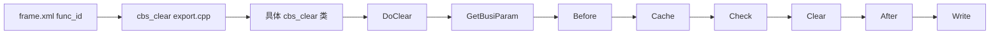

# cbs_clear 模块知识库

> 模块路径：`lbm_pro/macbs/cbs_clear/`  
> 模块定位：清算主模块，包含清算处理、清算分段、清算回滚、合约处理、清算金额计算等入口。

## 1. 模块入口

| 类型 | 文件 | 说明 |
|---|---|---|
| 构建入口 | `lbm_pro/macbs/cbs_clear/CMakeLists.txt` | 构建 `cbs_clear` 动态库，声明 include 目录、链接库和产物复制规则 |
| 导出入口 | `lbm_pro/macbs/cbs_clear/export.cpp` | 通过 `MACBS_CLEAR_LBM_API` 绑定导出函数、具体类和执行方法 |
| 运行配置 | `bin64/conf/frame.xml` | 通过 `func_id` 映射到动态库和导出函数 |

## 2. 导出函数索引

来自 `lbm_pro/macbs/cbs_clear/export.cpp`：

| func_id | 导出函数 | 具体类 | 执行方法 | 业务含义 |
|---|---|---|---|---|
| 680011 | `DoCalcRange` | `CClearDealCalcRange` | `DoClear` | 清算处理分段 |
| 680012 | `DoRestore` | `CClearDealRestore` | `DoClear` | 回滚清算处理 |
| 680013 | `DoClearBusiness` | `CClearDeal` | `DoClear` | 清算处理 |
| 680014 | `DoGpzySplit` | `CGpzySplit` | `DoClear` | 股票质押融资专户流水拆分 |
| 625057 | `DoGpzyLoanerInterest` | `CGpzyLoanerInterest` | `DoClear` | 股票质押债权人自动扣息/罚息入账 |
| 625052 | `DoKscBonusClaim` | `CKscBonusClaim` | `DoClear` | 跨市场挂账红利认领处理 |
| 625050 | `DoGeneratePerioddetail` | `CGeneratePerioddetail` | `DoClear` | 生成周期流水 |
| 680021 | `DoContractDealCalcRange` | `CContractDealCalcRange` | `DoClear` | 合约处理分段 |
| 680022 | `DoContractDealRestore` | `CContractDealRestore` | `DoClear` | 回滚合约处理 |
| 680023 | `DoContractDeal` | `CContractDeal` | `DoClear` | 合约处理 |
| 680030 | `DoClearamtCalcRestore` | `CClearamtCalcRestore` | `DoClear` | 清算金额回退 |
| 680031 | `DoClearamtCalcRange` | `CClearamtCalcRange` | `DoClear` | 清算金额计算分段/范围 |
| 680032 | `DoClearamtCalc` | `CClearamtCalc` | `DoClear` | 清算金额计算 |

## 3. 目录结构

`CMakeLists.txt` 当前显式包含的主要目录：

```text
lbm_pro/macbs/cbs_clear/
  clear_base/                         # 清算模块本地公共基类/公共能力
  clear_deal/clear_deal/              # 清算主处理
  clear_deal/clear_deal_calcrange/    # 清算处理分段
  clear_deal/clear_deal_restore/      # 清算处理回滚/恢复
  clear_deal/clear_deal/handler/      # 清算规则 handler
  clear_deal/clear_deal/handler/clear_pledge_cash/
  contract_deal/contract_deal/        # 合约主处理
  contract_deal/contract_deal_calcrange/
  contract_deal/contract_deal_restore/
  contract_deal/contract_deal/handler/
  generate_perioddetail/              # 生成周期流水
  ipoprocess/
  ksc_bonusclaim/                     # 跨市场挂账红利认领处理
  gpzy_split/                         # 股票质押流水拆分
  gpzy_loaner_interest/               # 股票质押债权人扣息/罚息
  rzxq_split/
  export.cpp
  CMakeLists.txt
```

## 4. 推荐阅读顺序

分析 `cbs_clear` 时建议按以下顺序阅读：

1. `lbm_pro/macbs/cbs_clear/export.cpp`：先确定目标 `func_id` 对应的导出函数、类和执行方法。
2. `lbm_pro/macbs/cbs_clear/CMakeLists.txt`：确认模块内包含哪些子目录和业务分支。
3. `clear_base/`：理解清算模块内部共享参数、公共工具和本地抽象。
4. 目标业务目录：
   - 清算主处理看 `clear_deal/clear_deal/`
   - 清算分段看 `clear_deal/clear_deal_calcrange/`
   - 清算回滚看 `clear_deal/clear_deal_restore/`
   - 合约处理看 `contract_deal/contract_deal/`
   - 合约分段/回滚看 `contract_deal/contract_deal_calcrange/`、`contract_deal/contract_deal_restore/`
5. 具体 `handler/`：在明确主流程调用关系后，再进入具体规则 handler。

## 5. 二次开发落点

| 需求类型 | 优先落点 | 说明 |
|---|---|---|
| 调整清算主流程 | `clear_deal/clear_deal/` | 影响清算处理整体阶段编排 |
| 调整清算分段 | `clear_deal/clear_deal_calcrange/` | 关注分段范围、批次、任务拆分 |
| 调整清算回滚 | `clear_deal/clear_deal_restore/` | 关注恢复顺序和写库补偿 |
| 调整合约主流程 | `contract_deal/contract_deal/` | 影响合约处理整体逻辑 |
| 调整单条清算规则 | `clear_deal/clear_deal/handler/` | 最窄修改面，优先用于规则级变更 |
| 调整股票质押流水拆分 | `gpzy_split/` | 对应 `DoGpzySplit` |
| 调整股票质押扣息/罚息 | `gpzy_loaner_interest/` | 对应 `DoGpzyLoanerInterest` |
| 调整周期流水生成 | `generate_perioddetail/` | 对应 `DoGeneratePerioddetail` |
| 新增对外入口 | `export.cpp` + `bin64/conf/frame.xml` + `CMakeLists.txt` | 需要同步配置导出函数、运行配置和构建 |

## 6. 与公共框架的关系

`cbs_clear` 的导出函数最终会创建具体业务类并调用 `DoClear()`，进入 `CMacbsClearBase` 的七阶段模型：



## 7. 待补充内容

后续可按业务需要继续补充：

- 各导出入口的具体类文件路径。
- `CClearDeal`、`CClearDealCalcRange`、`CClearDealRestore` 的继承链。
- `Cache/Clear/Write` 阶段的关键数据流。
- `handler/` 下各规则类职责索引。
- `comm_featureconfig` 与动态 handler 的配置关系。
- 关键表、cache manager、memdb/phydb manager 的读写清单。
