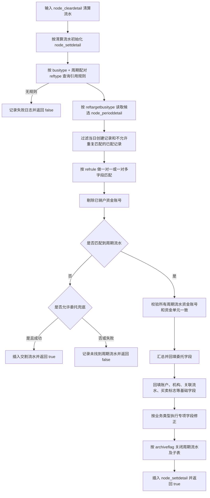

# cbs_clear_match 清算配对模块知识库

## 1. 模块定位

`cbs_clear_match` 是日终清算中的清算配对模块，负责把 `node_cleardetail` 清算流水按业务配置和配对方式转换为 `node_settdetail` 交割流水，并在需要时关联、更新历史交割流水、周期流水及其子表。

源码路径：`macbs-base/lbm_pro/macbs/cbs_clear_match/`。

关键入口：

| 关注点 | 位置 | 说明 |
|---|---|---|
| 构建目标 | `macbs-base/lbm_pro/macbs/cbs_clear_match/CMakeLists.txt` | 构建 `cbs_clear_match` 共享库，包含 `clearmatch`、`clearmatch_calcrange`、`clearmatch_restore`、`manualmatch` 等目录。 |
| 导出函数 | `macbs-base/lbm_pro/macbs/cbs_clear_match/export.cpp` | 导出分段、配对、恢复和手工配对入口。 |
| 主流程类 | `macbs-base/lbm_pro/macbs/cbs_clear_match/clearmatch/clearmatch.{h,cpp}` | `CClearMatch` 实现 `GetBusiParam`、`Before`、`Cache`、`Clear`、`Write` 七阶段中的主要阶段。 |
| 单笔配对调度 | `macbs-base/lbm_pro/macbs/cbs_clear_match/clearmatch/singlematch/single_clearmatch_base.cpp` | 按 `node_cleardetail.matchtype` 调用不同 `matchhandler`。 |
| 周期配对 handler | `macbs-base/lbm_pro/macbs/cbs_clear_match/clearmatch/matchhandler/match_period_base.{h,cpp}` | `CMatchPeriodBase`，处理 `MATCHTYPE_ZQPD` 周期配对。 |

## 2. 配对方式调度

`CSingleClearMatchBase::MatchByMatchType()` 按 `node_cleardetail.m_cMatchtype` 分发到不同 handler。周期配对对应：

| 配对类型 | 宏 | 含义 | handler |
|---|---|---|---|
| `a` | `MATCHTYPE_ZQPD` | 周期配对 | `cbs_clear_match.clearmatch.matchhandler.match_period` / `CMatchPeriodBase` |

执行顺序上，`CClearMatch::DoClearMatching()` 会先按特殊业务、优先配对类型和清算流水号排序。`MATCHTYPE_ZQPD` 不在 `PRIORITY_MATCHTYPE` 中，因此通常按清算流水顺序在优先类型之后处理。

## 3. 周期配对数据加载

`CClearMatch::CacheZQPD()` 为周期配对预加载以下数据：

1. `comm_busidefine_refrule`：业务定义引用规则表，使用 `idx_busitype_reftype` 索引。
2. `node_perioddetail`：周期流水表，按 `busitype` 索引加载，并过滤 `createdate == 当前业务日期` 的当日生成记录。
3. `node_perioddetailsub`：周期流水子表，按 `busiflowid` 索引加载。
4. `node_trade`：供周期流水未匹配时的委托兜底匹配使用，加载条件为 `matchtype == MATCHTYPE_ZQPD` 且 `applycode` 非空。

周期配对阶段的真正持久化发生在 `CClearMatch::Write()`：交割流水批量插入，周期流水和周期流水子表批量更新。

## 4. `CMatchPeriodBase` 类职责

`match_period_base.h` 定义了周期配对标准类：

| 成员 | 业务含义 |
|---|---|
| `Match(CNode_cleardetail_memdb&)` | 周期配对主入口。基于清算流水生成交割流水，查找历史周期流水并回填账户、委托、关联流水等信息。 |
| `ReMatchTrade(CNode_settdetail_memdb&)` | 周期流水未命中时，对指定业务执行委托兜底匹配。 |
| `m_objBusidefineRefUtil` | 按 `comm_busidefine_refrule.refrule` 解析并比较当前交割流水与目标周期流水字段。 |
| `m_setMatchedPerioddetail` | 记录本 handler 已匹配过的周期流水，用于配合 `repeatmatch` 控制重复匹配。 |
| `m_setMatchedYydm` | 要约类资金清算日去重集合，避免相同要约代码组合被重复用于委托信息回填。 |
| `CPerioddetailArchiveExt` | 匹配到的周期流水及其 `archiveflag` 的临时组合对象，后续统一决定是否归档。 |

handler 通过：

```cpp
REGISTER_CLEAR_HANDLER_CLASS("cbs_clear_match.clearmatch.matchhandler.match_period", CMatchPeriodBase)
```

注册到清算 handler 工厂，供 `CSingleClearMatchBase` 按路径实例化。

## 5. 周期配对引用规则

周期配对读取 `comm_busidefine_refrule` 时使用：

- `busitype = 当前清算流水业务类型`
- `reftype = BUSIDEFINE_REFTYPE_PERIODMATCH`

在当前宏定义中，`BUSIDEFINE_REFTYPE_PERIODMATCH` 的值为 `'0'`，数据库注释含义是“周期配对”；`reftype = '1'` 是“流水关联”。

`comm_busidefine_refrule` 中与周期配对直接相关的字段含义如下：

| 字段 | 含义 | 周期配对中的使用 |
|---|---|---|
| `busitype` | 当前业务类型 | 当前清算流水的业务类型。 |
| `reftype` | 引用类型 | 周期配对固定查 `'0'`。 |
| `reftargetbusitype` | 引用目标业务类型 | 候选周期流水的业务类型。 |
| `refrule` | 引用规则 | 字段比较规则，如 `applycode,stkid=stkid1`；无 `=` 表示同名字段相等，有 `=` 表示左侧当前流水字段与右侧目标流水字段比较；支持 `<>` 不等和数值正负号。 |
| `archiveflag` | 被引用记录是否归档 | 匹配成功后，若为 `1`，关闭被引用周期流水并更新归档日期。 |
| `multitype` | 多匹配方式 | `1` 表示一对多，调用 `MatchDetailMulti()`；否则一对一调用 `MatchDetail()`。 |
| `repeatmatch` | 是否允许重复匹配 | `0` 表示不允许重复匹配，周期候选过滤时会排除已匹配记录；`1` 表示允许重复匹配。 |

## 6. 周期配对主流程

`CMatchPeriodBase::Match()` 的主逻辑如下：



### 6.1 查找引用规则

周期配对要求当前业务类型在 `comm_busidefine_refrule` 中存在周期配对规则。如果查询不到规则，直接返回失败，并写入“未找到对应的业务定义引用规则”日志。

### 6.2 构造待插入交割流水

匹配前先用 `CNode_settdetailCacheManager::InitByCleardetail()` 按清算流水初始化交割流水，再调用 `SpecialInitSettdetailExt()` 补充特殊属性。后续匹配到的周期流水会继续覆盖或补齐账户、委托和关联字段。

### 6.3 按规则匹配历史周期流水

对每条引用规则：

1. 按 `reftargetbusitype` 从 `node_perioddetail` 查候选周期流水。
2. 排除 `createdate == 当前业务日期` 的周期流水，避免当天新生成的周期流水被当天再消费。
3. 当规则 `repeatmatch == FLAG_NO` 时，排除已匹配过的周期流水。
4. 使用 `CBusidefineRefUtil` 初始化当前表与目标表字段定义，按 `refrule` 逐字段比较：
   - `multitype == FLAG_YES`：一对多，所有满足规则的周期流水都进入结果集。
   - 否则：一对一，只取第一条满足规则的周期流水。
5. 匹配规则解析失败时抛业务异常，错误上下文包含当前清算流水号、当前业务类型、目标业务类型和 `refrule`。

### 6.4 过滤销户资金账号

匹配结果会再校验 `node_fundacct`：如果周期流水上的 `fundacct` 已经在当前缓存中查不到，则视为销户账户并从匹配结果中剔除。

### 6.5 未命中周期流水时的委托兜底

如果没有任何周期流水命中，只有特定业务会尝试 `ReMatchTrade()` 委托兜底。当前代码中集合为：

| 业务类型宏 | 说明 |
|---|---|
| `BUSITYPE_SH_PGPZ_ZJQS` | 上海配股配债资金清算类业务，代码中作为需要兜底委托配对的周期配对业务。 |

兜底匹配要求：

1. 交割流水 `applycode` 非空。
2. 用 `secuid + market + orderdate + applycode` 查唯一 `node_trade`。
3. 若未命中，且当前结算主体在 `m_strSubOrderidSettbodys` 中，则把登记公司合同序号截去前 2 位后按 8 位合同序号再查一次。
4. 必须唯一命中；未命中或多笔命中都返回失败。

兜底成功后，代码把 `node_trade` 的账户、资金单元、持仓单元、投资属性、委托号、委托数量、委托价格、冻结金额、成交关联字段等回填到交割流水，并把实际配对方式改成 `MATCHTYPE_BDHTXH`，然后插入交割流水。

## 7. 匹配成功后的字段处理

### 7.1 一致性校验和关联流水号

所有匹配到的周期流水必须属于同一个资金账号和资金单元；只要存在不一致，就记录错误并返回失败。

匹配成功的周期流水业务流水号会用逗号拼接到 `settdetail.refbusiflowid`，并设置：

| 字段 | 赋值来源 |
|---|---|
| `periodbusiflowid` | 代表周期流水的 `busiflowid`，默认取最终选中的 `pPerioddetail`。 |
| `refbusiflowid` | 所有匹配周期流水 `busiflowid` 的逗号拼接。 |
| `refbusiflowidsrc` | 固定置为 `SETTDETAIL_REFBUSIFLOWIDSRC_PERIOD`，表示关联流水号来源是周期流水。 |
| `matchstatus` | 固定置为 `MATCHSTATUS_ZDPD`，表示自动配对。 |

### 7.2 委托字段汇总规则

通用逻辑以第一条匹配周期流水初始化委托信息，然后遍历所有匹配结果：

| 字段 | 通用处理 |
|---|---|
| `orderqty` | 累加匹配周期流水的 `orderqty`。 |
| `orderid` | 默认取代表周期流水的 `applycode`；遍历时若发现更晚的周期流水，会改为更晚流水的 `applycode`。 |
| `orderprice` | 默认取代表周期流水的 `orderprice`；更晚周期流水胜出时同步更新。 |
| `ordersno` | 默认取代表周期流水的 `ordersno`；更晚周期流水胜出时同步更新。 |
| `bsflag` | 默认取代表周期流水的 `bsflag`；更晚周期流水胜出时同步更新。 |
| `orderdate` | 默认取代表周期流水的 `orderdate`；更晚周期流水胜出时同步更新。 |
| `ordertime` | 用 `orderdate + ordertime` 格式化为 `YYYYMMDD + 9 位时间`，保留更晚的委托时间。 |

“更晚周期流水”的判断口径是：`orderdate` 更大，或 `orderdate` 相同且 `ordersno` 更大。

### 7.3 基础账户和机构字段回填

最终代表周期流水 `pPerioddetail` 会回填以下字段：

- 账户体系：`settunit`、`fundacct`、`fundunit`、`stkholdunit`。
- 机构体系：`trdsysid`、`coreid`、`orgid`、`brhid`。
- 操作与交易信息：`operid`、`operway`、`operorg`、`trdseat`、`netaddr`、`bsflag`。
- 成交编号：除 `012304`、`024902`、`024904` 外，`matchcode` 从周期流水回填。

### 7.4 发行代码回填

以下上市、待上市、撤指定等业务会把周期流水的 `stkid` 回填到交割流水 `stkid1`，用于表达发行代码或原业务证券代码关系：

`022004`、`022009`、`012005`、`012010`、`502005`、`022106`、`012015`、`018157`、`018159`、`022013`、`018146`、`018148`、`018150`、`018145`、`018147`、`018149`。

## 8. 专项业务处理

### 8.1 要约资金清算日委托信息处理

适用业务类型：`012203`、`022203`、`502203`。

处理要点：

1. 周期流水按 `stkid + stkid1 + orderprice` 组成要约分组键。
2. 同一分组已在 `m_setMatchedYydm` 中处理过，则跳过，避免重复选中同一要约组合。
3. 上海市场还要求分组周期流水价格与当前交割流水 `matchprice` 一致；深圳、股转、北交所因结算数据可能没有价格，放宽价格判断。
4. 分组内若周期业务类型为解除预受类（`012202`、`022202`、`502202`），委托数量按负数计入；其他预受类按正数计入。
5. 选择分组内 `bsflag == "0Y"` 且最早的周期流水作为代表委托；当市场不是上海，或汇总数量等于当前交割流水 `abs(matchqty)` 时，回填 `orderid`、`orderprice`、`orderqty`、`ordersno`、`bsflag`、`orderdate`、`ordertime`。

### 8.2 债券回售资金交收日委托信息处理

适用业务类型：`012304`、`022304`、`502303`、`502306`。

处理要点：

1. 债券回售撤销/解除类周期流水（`022302`、`012302`、`502302`）的 `orderqty` 按负数计入，其余按正数计入。
2. 对回售申请类周期流水（`022301`、`012301`、`502301`），以最早的申请周期流水作为委托信息来源。
3. 代表申请流水会回填 `orderid`、`orderprice`、`ordersno`、`bsflag`、`orderdate`、`ordertime`。

### 8.3 ETF/LOF/REITs 认购上市金额价格处理

适用上市业务：`022013`、`012015`。

默认处理：

- `matchamt` 从代表周期流水回填。
- `matchprice` 从代表周期流水回填。

REITs 认购结果类周期流水（`0127R1` 至少在当前代码分支中处理）会优先读取周期流水子表 `confirmedamt`，若存在则覆盖 `matchamt`。

国信个性化参数 `m_cJjrgShGgtPeriodMatchAmtAndPrice` 为 `FLAG_NO`，且代表周期流水业务类型属于 `022011`、`012013`、`012026`、`0127R1`、`0127R2`、`0127R3` 时，上市交割流水不保留周期流水的 `matchamt` 和 `matchprice`，两者置为 0。

### 8.4 认购失败/退款类子表透传

适用业务类型：

- `BUSITYPE_SHLOFRGJGSB`
- `BUSITYPE_SHJJRGJGRZSB`
- `BUSITYPE_SHLOFRGJGPSSB`
- `BUSITYPE_SHLOFRGJGKMSB`

处理方式：从代表周期流水的 `node_perioddetailsub` 读取并透传以下字段到当前交割流水子表映射：

- `matchamt`
- `matchqty`
- `fee_yjf`
- `fee_sxf`
- `fee_other`

该逻辑用于解决退款类配置字段与周期流水子表字段不一致导致金额取不到的问题。

### 8.5 深圳基金现金认购失败返款部分失败处理

归档前对 `BUSITYPE_SZJJXJRGFKWX` 有特殊判断：

1. 把匹配周期流水的 `matchqty` 写入当前交割流水 `qty1`。
2. 若当前交割流水 `abs(matchqty)` 与周期流水 `abs(qty1)` 不相等，视为部分失败，不关闭 T 日认购申请周期流水，留待后续日期继续处理。

## 9. 周期流水归档规则

匹配成功后，代码按每条匹配结果携带的 `archiveflag` 决定是否关闭周期流水：

1. `archiveflag != FLAG_YES`：不归档，仅生成当前交割流水。
2. `archiveflag == FLAG_YES`：
   - 周期流水子表 `node_perioddetailsub`：设置 `archivedate = 当前业务日期`、`updatedate = 当前业务日期`，并更新。
   - 周期流水主表 `node_perioddetail`：设置 `updatedate = 当前业务日期`、`archivedate = 当前业务日期`、`status = '1'`，并更新。

注意：上述更新先落在 cache manager，最终由 `CClearMatch::Write()` 批量写入内存库。

## 10. 二次开发关注点

1. 新增周期配对业务时，至少检查：
   - `comm_busidefine.matchtype` 是否配置为 `MATCHTYPE_ZQPD`。
   - `comm_busidefine_refrule` 是否存在 `reftype = '0'` 的周期配对规则。
   - `reftargetbusitype` 对应的历史业务是否会生成 `node_perioddetail`。
   - `archiveflag`、`multitype`、`repeatmatch` 是否符合业务闭环。
2. `refrule` 字段左侧表示当前交割流水字段，右侧表示目标周期流水字段；不要把方向写反。
3. 周期配对只消费非当日创建的周期流水；如果业务需要当日生成当日消费，不能直接复用当前逻辑，需要专项设计。
4. 一对多匹配后要求所有周期流水资金账号和资金单元一致；跨账户聚合类需求不能直接套用当前 handler。
5. 归档会关闭被引用周期流水，影响后续日期是否还能继续匹配；部分失败、分批确认、允许重复使用的业务要特别确认 `archiveflag` 和 `repeatmatch`。
6. 若只是增加客户特有周期配对差异，优先放在客户定制 handler 或客户配置目录，避免扩大公共逻辑影响面。
