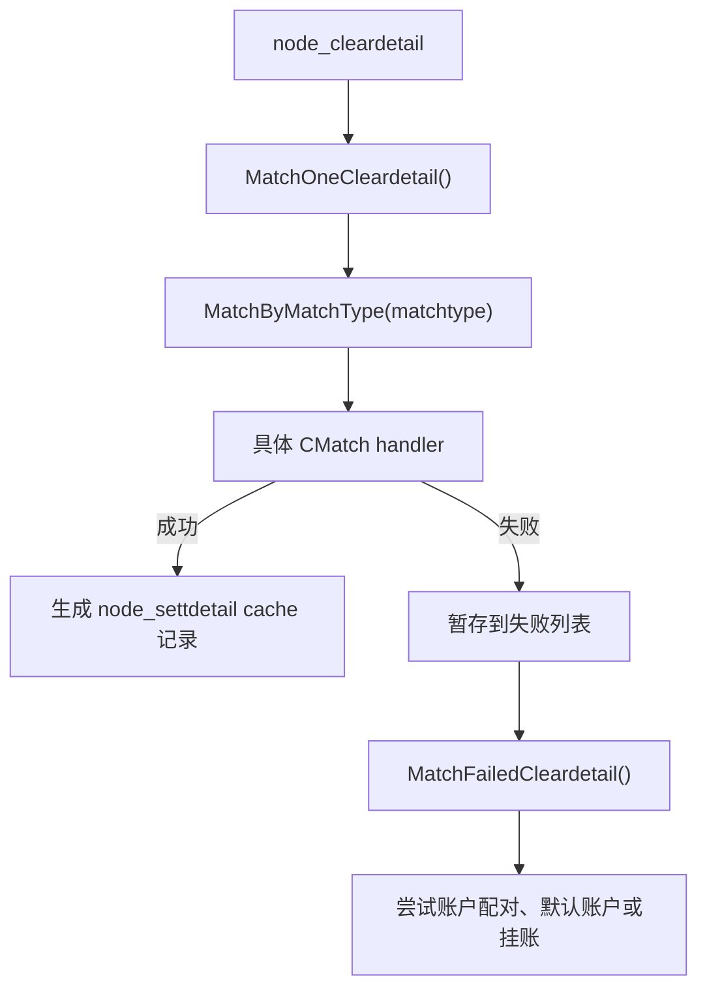

# 主流程与数据流

## 七阶段实现

`680003` 由 `CClearMatch::DoClear()` 执行，当前模块覆盖 `GetBusiParam()`、`Before()`、`Cache()`、`Clear()`、`Write()`。

| 阶段 | 方法 | 主要逻辑 |
|---|---|---|
| 业务参数 | `GetBusiParam()` | 读取 `markets`、`dealpoint`、`threadno`、`beginsecuid`、`endsecuid`、`dealCount`，校验股东分段边界，加载上一业务日和结算主体参数。 |
| 前处理 | `Before()` | 加载托管席位来源、账户配对兜底、港股账户兜底、周期配对金额价格等开关；初始化 `node_settdetail`、`node_debtdetail` manager 的日期、流程号和流水号前缀。 |
| 缓存 | `Cache()` | 按配置、清算流水、账户、各配对方式依赖数据顺序加载 cache。 |
| 处理 | `Clear()` | 获取 `CSingleClearMatch` 实例；按股东账户分组逐条配对；处理失败流水；执行配对后拆分、业务转换、交割子表和负债明细生成。 |
| 写入 | `Write()` | 批量插入交割流水、交割流水子表、负债明细、限售股不扣税记录、多头户结果；批量更新周期流水、周期流水子表、股东账户。 |

## 缓存顺序

`CClearMatch::Cache()` 的顺序体现了配对依赖关系：

1. `CacheConfig()`：清算账户配置、业务配置、席位配置、业务拆分/转换配置、业务定义、业务字段、证券、行情、系统用户、债券兑息兑付、限售股不扣税、分区模板。
2. `CacheClearData()`：按业务日期、结算主体、市场、处理时点、股东范围加载 `node_cleardetail` 和 `node_cleardetailsub`。
3. `CacheAccount()`：加载股东账户、资金账号、资金单元、持仓单元、结算单元、资金账号银行信息；股东为空的分段会反向从资金账号加载股东账户。
4. 各配对方式缓存：`CacheBDHTXH()`、`CacheJJGSHTXH()`、`CacheJGLS()`、`CacheT0ZHYE()`、`CacheTM1ZHYE()`、`CacheTM2CCSZ()`、`CacheACCT()`、`CacheZQPD()`、`CacheTSPD()`、`CacheOther()`、`CacheTM1LinkStkid()`。

## 单股东处理顺序

`DoClearMatching()` 对同一股东代码的清算流水排序后逐条处理。排序优先级：

1. 特殊转托管出业务优先：`028114`、`028102`、`028135`、`048102`、`048111`、`618113`、`508104`。
2. 优先配对方式优先：`MATCHTYPE_BDHTXH`、`MATCHTYPE_JJGSHTXH`、`MATCHTYPE_JYSHTXH`、`MATCHTYPE_JDHTH`、`MATCHTYPE_JGLS`、`MATCHTYPE_WXPD`。
3. 同优先级内按 `clearflowid` 升序。

这套排序的业务目的，是让能校正账户席位的流水先执行。优先配对成功后，若满足市场和开关条件，会通过 `AddSecuidToUpdateMainseat()` 刷新股东账户托管席位，供后续账户配对使用。

## 单笔配对与失败处理

正常路径：

`MATCHTYPE_BDHTXH` 有一层特殊逻辑：先调用 `CMatchTradeBase` 做委托配对；如果委托配对失败，立刻在同一次 `MatchByMatchType()` 中调用 `CMatchAccount` 做账户配对。

其他失败流水统一在 `CSingleClearMatch100::MatchFailedCleardetail()` 中处理：

- 原配对类型不是账户配对：若属于多头股东账户，调用 `CMatchDefaultBase::SetHghlClear()` 记录多头红股红利结果；否则尝试 `CMatchAccount`。
- 原配对类型是账户配对：直接调用 `CMatchAccount::AddNodeMutisecuidResult()` 记录多头户不处理结果。
- 二次处理仍失败：调用 `CMatchDefaultBase::BuildUnMatchedSettdetailext()` 生成挂账交割流水。
- 失败处理结束后，对最后一条交割流水执行 `CMatchDefaultBase::AfterClearPair()`。

## 配对后处理

`AfterClearMatch()` 只处理本次插入的交割流水：

- `SetBaseInfo()` 补银行代码等基础信息。
- `CSettdetailSplitUtil::SplitSettdetail()` 按业务拆分配置拆分交割流水。
- `DealBusitypetranscfg()` 按业务摘要转换配置调整交割流水业务类型。
- `DealDxdfTax()` 生成付息兑付利息所得税交割流水。

`AfterInitResultData()` 负责把交割流水对象中的 `m_mapSettdetailsub` 落成 `node_settdetailsub`，并按后续规则生成负债明细等衍生数据。

## 写入边界

配对阶段通过 cache manager 新增或更新对象，不直接持久化。真正写入在 `Write()` 中完成：

- `BatchInsert()`：`node_settdetail`、`node_settdetailsub`、`node_debtdetail`、`node_restrictcust_notax_rec`、`node_mutisecuid_result`。
- `BatchUpdate()`：`node_perioddetail`、`node_perioddetailsub`、`node_secuid`。

这意味着调整配对逻辑时，要区分“生成/修改 cache 对象”和“最终写内存库”的阶段边界。
