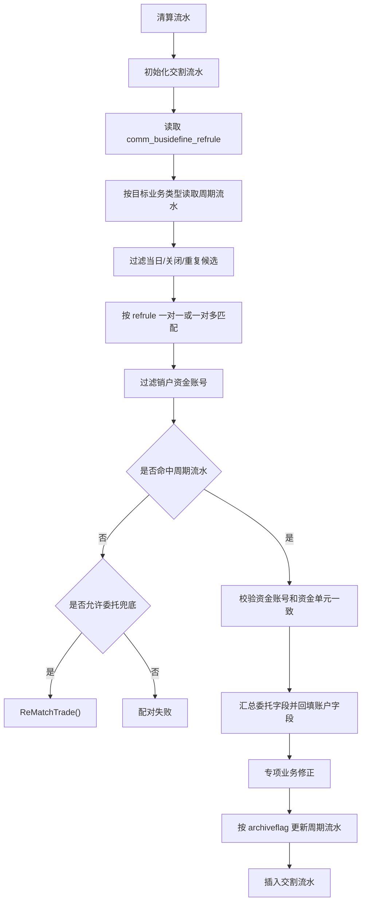

# 交割流水与周期配对

本文覆盖：

- `MATCHTYPE_JGLS`：交割流水配对，对应 `CMatchSettdetailBase`。
- `MATCHTYPE_ZQPD`：周期配对，对应 `CMatchPeriodBase`。

## 交割流水配对：`MATCHTYPE_JGLS`

入口：`CMatchSettdetailBase::Match()`。

候选查找：

1. 按 `secuid + stkid + applycode` 从 `node_settdetail` 查历史交割流水。
2. 只处理 `createdate < 当前业务日期` 的历史流水。
3. 常规命中条件是 `orderdate` 相同且 `busitype` 相同。

特殊命中条件：

- 融资行权业务 `021903/011903`：要求业务类型相同。
- 约定购回补充交易：当前业务 `015401` 至 `015404`、`025401` 至 `025404`，可匹配历史转换业务 `0154A1` 至 `0154A4`、`0254A1` 至 `0254A4`，同时要求 `settcode` 相同。
- ETF/基金认购退保确认、可交换债等业务：`012012/012013/022011/022012/010105/010106/040103/040104` 直接取历史候选。
- `022501/022502`：要求历史流水 `specialbusitype` 等于当前业务类型，并回填 `extbsflag`。

成功后的处理：

- `AssignOneClearDetailBySettdetail()` 用历史交割流水补齐清算流水账户、席位、机构、委托、业务流水号等字段。
- 新生成交割流水的 `refbusiflowid` 写历史交割流水号。
- 调用 `SpecialInitSettdetailExt()`。
- 认购失败/退款类业务会把历史交割流水子表的 `matchamt`、`matchqty`、`fee_yjf`、`fee_sxf`、`fee_other` 透传到新交割流水子表映射。
- 约定购回 T+1 结果命中时，把业务类型改为对应 `0154A*` 或 `0254A*`。

## 周期配对：`MATCHTYPE_ZQPD`

入口：`CMatchPeriodBase::Match()`。

周期配对用 `comm_busidefine_refrule` 表驱动，读取条件：

- `busitype = 当前清算流水业务类型`
- `reftype = BUSIDEFINE_REFTYPE_PERIODMATCH`

没有规则时直接失败并写流程日志。

## 周期配对规则字段

| 字段 | 周期配对含义 |
|---|---|
| `reftargetbusitype` | 目标周期流水业务类型，用于从 `node_perioddetail` 查候选。 |
| `refrule` | 当前交割流水与目标周期流水的字段比较规则，支持同名字段、`左字段=右字段`、不等和数值正负号。 |
| `multitype` | `FLAG_YES` 时一对多匹配，调用 `MatchDetailMulti()`；否则一对一，只取第一条命中。 |
| `repeatmatch` | `FLAG_NO` 时，同一 handler 已匹配过的周期流水不再参与后续匹配。 |
| `archiveflag` | 匹配成功后是否关闭目标周期流水。 |

## 周期候选过滤

周期候选来自 `node_perioddetail`，按目标业务类型读取后再过滤：

- `createdate < 当前业务日期`，当日生成周期流水不参与当日消费。
- `status == '0'`，只允许历史正常周期流水。
- `repeatmatch == FLAG_NO` 时，排除当前 handler 中已匹配过的周期流水。

匹配后还会过滤掉资金账号不存在的周期流水，避免销户资金账号继续配对。

## 周期配对主流程

## 周期配对成功字段

一组命中的周期流水必须资金账号和资金单元一致；否则失败。

通用回填：

- `periodbusiflowid`：代表周期流水业务流水号。
- `refbusiflowid`：所有命中周期流水业务流水号逗号拼接。
- `refbusiflowidsrc`：置为周期流水来源。
- `matchstatus`：置为自动配对。
- 账户和机构字段：`settunit`、`fundunit`、`stkholdunit`、`fundacct`、`trdsysid`、`coreid`、`orgid`、`brhid`。
- 委托字段：默认汇总 `orderqty`，并选取更晚的周期流水回填 `orderid`、`orderprice`、`ordersno`、`bsflag`、`orderdate`、`ordertime`。

“更晚”的判断是 `orderdate` 更大，或同一 `orderdate` 下 `ordersno` 更大。

## 未命中周期流水的委托兜底

当前只有 `BUSITYPE_SH_PGPZ_ZJQS` 在 `setNeedMatchTradeBusitype` 中允许 `ReMatchTrade()`。

兜底条件：

1. 交割流水 `applycode` 非空。
2. 按 `secuid + market + orderdate + orderid` 查唯一 `node_trade`。
3. 若未命中且结算主体在 `PARAMID_STRSUB_ORDERID_SETTBODY` 中，截去申请编号前两位再查。
4. 未命中或多条命中都失败。

兜底成功后，交割流水的真实配对方式改为 `MATCHTYPE_BDHTXH`。

## 周期专项业务逻辑

要约资金清算日 `012203/022203/502203`：

- 按 `stkid + stkid1 + orderprice` 分组。
- 上海市场要求周期流水价格与当前 `matchprice` 一致；深圳、股转、北交所放宽价格。
- 解除预受类周期流水 `012202/022202/502202` 的委托数量按负数计入。
- 选择分组内 `bsflag == 0Y` 且最早的周期流水作为代表委托。
- 同一要约分组通过 `m_setMatchedYydm` 去重。

债券回售资金交收日 `012304/022304/502303/502306`：

- 撤销/解除类 `022302/012302/502302` 的委托数量按负数计入。
- 申请类 `022301/012301/502301` 中最早的周期流水作为代表委托。

基金/ETF/REITs 认购上市 `022013/012015`：

- 默认从代表周期流水回填 `matchamt` 和 `matchprice`。
- REITs 认购结果类周期流水 `0127R1` 至 `0127R6` 可优先用周期子表 `confirmedamt` 覆盖 `matchamt`。
- 参数 `PARAMID_JJRGSH_GET_PERIOD_MATCHAMT_PRICE` 为否时，且代表周期业务属于 `022011/012013/012026/0127R1/0127R2/0127R3`，上市流水不保留认购申请周期流水的成交金额和成交价格。

认购失败/退款类：

- `BUSITYPE_SHLOFRGJGSB`
- `BUSITYPE_SHJJRGJGRZSB`
- `BUSITYPE_SHLOFRGJGPSSB`
- `BUSITYPE_SHLOFRGJGKMSB`

这些业务会透传周期流水子表的 `matchamt`、`matchqty`、`fee_yjf`、`fee_sxf`、`fee_other`。

深圳基金现金认购失败返款 `BUSITYPE_SZJJXJRGFKWX`：

- 归档前把周期流水 `matchqty` 写入当前交割流水 `qty1`。
- 如果当前 `matchqty` 与 `qty1` 不相等，视为部分失败，不关闭 T 日认购申请周期流水。

## 周期流水归档

`archiveflag == FLAG_YES` 时：

1. 周期流水子表设置 `archivedate = 当前业务日期`、`updatedate = 当前业务日期`，并 `Update()`。
2. 周期流水主表设置 `updatedate = 当前业务日期`、`archivedate = 当前业务日期`、`status = '1'`，并 `Update()`。

最终由 `CClearMatch::Write()` 批量更新内存库。
