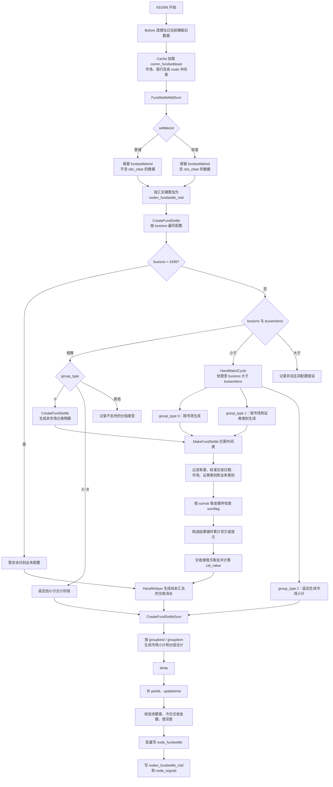

# cbs_report 保证金日结表生成逻辑和数据流分析

## 1. 分析范围

本文分析 `cbs_report` 模块中以下功能号与保证金日结表相关的数据流：

| 功能号 | 导出模块 | C++ 类/方法 | 职责 |
| --- | --- | --- | --- |
| `631005` | `DoFundSettleMidRestore` | `CNodeFundSettleMidRestore::DoClear` | 重做前恢复，按恢复标志清空 `node_fundsettle_mid` 内存表 |
| `631004` | `DoFundSettleMidCalcRange` | `CNodeFundSettleMidCalcRange::DoClear` | 按 `node_fundacct.settgroup` 计算分片区间 |
| `631003` | `DoFundSettleMidCreateData` | `CNodeFundSettleMidCreateData::DoClear` | 在 node 侧生成 `node_fundsettle_mid` 中间表 |
| `631006` | `DoNodexFundSettle` | `CNodexFundSettle::DoClear` | 在 nodex 侧汇总 node 中间表，并按配置生成 `node_fundsettle` |
| `631007` | `QryFundSettle` | `CMarginDaySett::QryFundSettle` | 查询普通保证金日结表 |

入口映射来自：

- `bin64/conf/frame.xml` / `frame-win.xml`：功能号到动态库和导出模块的映射。
- `lbm_pro/macbs/cbs_report/export.cpp`：导出模块到类方法的映射。
- `database/script/full/gauss/fs_cbs/fs_cbs_comm/2.data/flow/*/comm_flowrecord.sql`：流程任务如何串联三段式处理。

## 2. 流程配置中的调用方式

保证金日结表在清算流程中通常采用三段式任务：

1. `prehandlefuncid = 631005`：重做前恢复。
2. `shardingfuncid = 631004`：生成分片参数。
3. `funcid = 631003`：按分片生成 node 中间表。
4. 后续独立任务 `631006`：在 nodex 上做尾处理和最终表生成。

标准 Gauss 普通流程示例：

- `21_公募客户清算`：`900112` 为“生成保证金日结表”，`funcid=631003`、`shardingfuncid=631004`、`prehandlefuncid=631005`；`900118` 为“保证金日结表尾处理”，`funcid=631006`。
- `25_普通客户清算`：同样先 `631003/631004/631005`，再 `631006`。

国信证券标准保证金日结表示例：

- `900112` 的 `631003` 参数包含 `settlekind=1`，表示同时生成普通与标准中间表。
- `900210` 调用 `631006` 生成普通保证金日结表。
- `900211` 再调用 `631006` 且参数包含 `settlekind=1`，生成标准保证金日结表。

## 3. 普通保证金日结表数据流

整体链路：

```text
流程配置 comm_flowrecord
  -> 631005 清空 node_fundsettle_mid
  -> 631004 按 settgroup 分片
  -> 631003 node 侧读取业务源数据并汇总到 node_fundsettle_mid
  -> 631006 nodex 拉取各 node 的 node_fundsettle_mid
  -> nodex 汇总为 nodex_fundsettle_mid
  -> 按 comm_fundsettleset 生成 node_fundsettle
  -> 631007 从 node_fundsettle / node_his_fundsettle 查询并聚合展示
```

### 3.1 `631005` 重做前恢复

`CNodeFundSettleMidRestore` 只在 `restoreflag` 不是否时继续执行。其核心动作是在写锁下清空 `node_fundsettle_mid` 内存表，避免重跑时旧中间数据与本次结果混合。

该功能只处理中间表恢复，不直接清 `node_fundsettle`。最终表由 `631006` 的 `Before()` 按当日和模板清理。

### 3.2 `631004` 计算分片

`CNodeFundSettleMidCalcRange` 读取 `node_fundacct`：

- 按 `settbody` 过滤结算主体。
- 统计每个 `settgroup` 的资金账户数量。
- 用 `CalcMapRangeByBatchSize()` 按 `settgroup` 输出 `beginsettgroup`、`endsettgroup`、`threadno` 等分片参数。

因此 `631003` 的并行边界是结算分组，不是机构、币种或市场。

### 3.3 `631003` 生成 node 中间表

`CNodeFundSettleMidCreateData` 按七阶段执行，关键阶段如下。

#### 业务参数

从流程参数和公共参数取：

- `threadno`、`beginsettgroup`、`endsettgroup`：来自 `631004` 分片结果。
- `settlekind`：缺省为普通模式；`1` 表示需要生成标准保证金日结表中间数据。
- `PARAMID_TEMPLATE_ID(70008)`：普通保证金日结表模板号。
- `PARAMID_TEMPLATE_ID_STDFUNDSETTLE(75015)`：标准保证金日结表模板号，仅标准模式读取。
- `PARAMID_BZJRJB_UNCOMMIT_KM(61115)`：今日未交收金额有效资金变动科目。
- `PARAMID_BZJRJB_ZJHS_UNCOUNT_ACCT(61120)`：资金户数不统计的资金账号。
- `PARAMID_BZJRJB_ADJUSTBAL_ORIVAL_BUSITYPES(61122)`：未交收金额使用原始 `adjustbal/clearamt` 判断方向的业务类别。
- 利率天数参数：用于 `FUND_CKYJLX` 存款预计利息最终年化折算。

#### 缓存数据

`Cache()` 阶段加载以下数据：

- 配置：`comm_busifield`、`comm_fundsettle_trans`、`comm_fundsettle_trans_rule`。
- 利率：`comm_curintrrate`、`comm_intrate_group`、`node_fund_special_intrrate`、`node_cust_curintrrate`。
- 账户：`node_settunit`、`node_fundunit`、`node_fundacct`、`node_fundacct_bank`。
- 流水：当日 `node_logasset`、当日生成且资金交收日在未来的 `node_settdetail`、`node_settdetailsub`、`node_fundchange`。
- 资产汇总：`node_fundbookkeeping`、`node_stkholdbookkeeping`、`node_creditdebt`。
- `node_fundhangasset` 只在主 nodex 条件下加载。

#### 中间表聚合口径

`DoCreateFundSettleData()` 依次把不同源数据聚合成 `node_fundsettle_mid`：

| 源表/来源 | 生成的中间业务项 | 关键金额字段 | `sourcetype` |
| --- | --- | --- | --- |
| `node_logasset` + `node_fundchange` | 当日已发生交收/资金股份流水 | `fundeffect`、`matchamt`、各类费用、发生笔数、成交数量 | `0` 交收流水 |
| `node_settdetail` + `node_settdetailsub` | 当日产生但资金交收日在未来的未交收数据 | `fundeffect`、`matchamt`、各类费用、发生笔数、成交数量 | `4` 当天待交收 |
| `node_fundbookkeeping` | 资金余额期初/期末、预计利息、累计利息积数、利息税等 | `sumamt` | `1` 资产汇总 |
| `node_stkholdbookkeeping` | 证券市值 | `sumamt` | `1` |
| `node_fundacct` | 总户数、销户数、正常/冻结/挂失、当日开户/销户 | `timeseffect` | `1` |
| `node_creditdebt` | 当日/昨日融资余额 | `sumamt` | `1` |
| `node_fundhangasset` | 虚拟账户余额 | `sumamt` | `1` |

中间表聚合 key 主要由以下维度组成：

`orgid + custkind + custgroup + bankcode + curcode + stktype + market + bankattr + busitype + status + biztype + corpid + serverid + sourcetype + reportkind + fundsettlekind + fundrealsettdate + fundaccttype + coreid + organ_flag`

`bankcode`/`bankattr` 的解析规则：

- 人民币且资金账户银行信息存在有效银行代码时，按三方存管处理。
- 非人民币、无银行信息或银行代码为 `0` 时，使用默认银行代码 `-1`，银行属性置为非三方存管。
- 另库机构银行代码映射会二次修正银行代码。

#### 金额转换规则

普通情况下：

- `node_logasset` 依据 `comm_busidefine.funddirect` 决定 `matchamt/intramt` 的正负方向，费用字段通常按负值写入。
- `node_settdetail` 默认从 `node_settdetailsub.fieldname/fieldvalue` 映射到中间表字段。

特殊业务通过配置覆盖默认转换：

- `comm_fundsettle_trans`：按 `busitype` 找 `ruleid`。
- `comm_fundsettle_trans_rule`：按 `ruleid + s_fieldname` 指定目标字段 `d_fieldname` 和方向 `trans_direct`。
- `trans_direct=1` 取源字段原值；`trans_direct=2` 取源字段反向值。
- 目标字段支持写入 `matchamt`、`fee_jsxf`、`fee_sxf`、`fee_yhs`、`fee_sk_yhs`、`fee_ghf`、`fee_qsf`、`fee_jygf`、`fee_jsf`、`fee_zgf`、`fee_qtf`、`fee_chjzf`、`intramt`、`taxamt`、`buybackamt`、`fee_back`、`fee_dlf`、`intrtax`、`fee_fxj` 等。

`Write()` 阶段会：

- 对 `BUSITYPE_FUND_CKYJLX` 按币种利率天数做折算：`round(sum(利息积数 * 利率) / 年计息天数, 2)`。
- 生成 `sno`。
- 设置 `partid`。
- 批量插入 `node_fundsettle_mid` 内存表。

### 3.4 `631006` nodex 汇总与正式表生成

`CNodexFundSettle` 按清算阶段完成“清理旧结果 -> 加载配置和中间数据 -> 汇总 node 数据 -> 生成明细 -> 生成小计/合计 -> 校验并写入正式表”。其中 `Clear()` 阶段的固定调用顺序是：

```text
FundSettleMidSum() -> CreateFundSettle() -> CreateFundSettleSum()
```

#### 清理目标表

`Before()` 清理：

- `nodex_fundsettle_mid`：按 `createdate + templateid` 删除，测试模式除外。
- `node_fundsettle`：按 `createdate + templateid` 删除。
- `node_orgsett`：全表清空，用于交收结算统计。

#### 拉取和汇总 node 中间表

`Cache()` 加载：

- `comm_fundsettleset`：按当前模板号 `templateid=GetTemplateId()` 加载并按 `busisno` 排序。
- `comm_marketcurcode`：根据流程币种参数加载市场列表，用于按市场循环生成小计。
- `comm_bank`：加载存管银行，并补 `-1` 兜底银行。
- `node_fundsettle_mid`：先加载 nodex 本地，再通过 `CRemoteMemdbSync` 从普通 node 拉取 `TAB_CODE_FUNDSETTLE_MID`。

`FundSettleMidSum()` 将所有 `node_fundsettle_mid` 汇总为 `nodex_fundsettle_mid`：

- 普通模式只取 `fundsettlekind` 不含 `cbs_clear` 的记录。
- 标准模式只取 `fundsettlekind` 含 `cbs_clear` 的记录。
- 以和 node 中间表相同的维度作为汇总 key，数值字段累加。
- 汇总后把原 `node_fundsettle_mid` 缓存清空，后续只使用 `nodex_fundsettle_mid`。

#### `node_fundsettle` 生成总流程



#### 1. 遍历配置并确定生成方式

`CreateFundSettle()` 遍历已经按 `busisno` 升序排列的 `comm_fundsettleset`：

- `busisno=4295` 的配置不立即生成，先保存为“未识别业务”规则。
- `busisno == buisendsno` 表示单项配置或市场循环末项：主循环直接遇到该配置时，`group_type=0` 立即生成明细，`group_type=A/B` 留到小计/合计阶段；市场循环末项常用的 `group_type=2` 由 `HandMakrtCycle()` 识别并延后生成市场小计。
- `busisno < buisendsno` 表示市场循环区间，调用 `HandMakrtCycle()` 连续处理到 `busisno > buisendsno`。
- `busisno > buisendsno` 属于非法配置，生成小计/合计前会记录错误并跳过。

#### 2. 定位候选中间数据

`CreateFundSettle(const CComm_fundsettleset_memdb&, ...)` 先解析贷方和借方业务类别，再决定扫描方式：

- 配置了具体 `asset_busitype/debtor_busitype` 时，优先使用 `nodex_fundsettle_mid` 的 `busitype` 索引，只扫描命中的业务类别。
- 形如 `1234**` 的配置按业务类别前四位通配，node 中间表转为 nodex 记录时已同时生成对应的通配业务类别字符串。
- 配置有项目名称但业务类别为空时，表示业务类别不限，需要遍历全部 `nodex_fundsettle_mid`。
- 贷借业务类别先合并去重，避免同一具体业务类别同时出现在两侧时被重复扫描。

#### 3. `MakeFundSettle()` 逐条匹配

候选中间记录必须依次通过以下条件：

1. `sourcetype` 匹配。配置来源 `3` 可匹配中间表来源 `0`；来源 `x` 仅匹配非三方存管且使用默认银行的交收流水。
2. 标准模式额外匹配资金实际交收日期：当日已交收要求 `fundrealsettdate == busidate`；来源 `4` 可接收 `fundrealsettdate != busidate` 的交收流水作为当日未交收。
3. 需要按市场分组时，中间记录的 `market` 不能为空。
4. `pt_stktype` 限制允许的证券类别，`@` 表示不限制；`fd_stktype` 排除指定证券类别。
5. `asset_busitype/debtor_busitype` 命中具体或通配业务类别。贷方先判断，未命中贷方时再判断借方。

过滤通过后，`GetFieldValue()` 根据 `sumstr` 读取 `fundeffect`、`matchamt`、`sumamt`、`sumqty`、`timeseffect`、各类费用、利息或税费等金额字段。

对于来源 `0` 的交收流水，`GetFieldValue()` 同时使用 `nodex_fundsettle_mid.sumflag` 防止重复汇总：

- 已汇总 `fundeffect` 后，再汇总该记录的其它组成字段会被忽略。
- 已汇总其它组成字段后，再汇总 `fundeffect` 会被忽略。
- 同一个 `sumstr` 字段被第二次命中也会被忽略。
- 只有非零金额才设置对应位置的汇总标识。

#### 4. 构造结果键并累计金额

一条配置命中的多条中间记录不会直接生成多行，而是先写入 `m_objFundsettleMgr.m_mapFundSettle`。结果键由以下维度组成：

```text
orgid + custkind + custgroup + bankcode + bankattr + curcode
+ busisno + market + stktype + reportkind + fundsettlekind
+ fundrealsettdate + coreid + fundaccttype + organ_flag
```

其中 `market/stktype` 是否进入有效分组取决于 `group_type`：

- 非分类明细：结果键中的 `market/stktype` 置空。
- 按市场明细：保留 `market`，`stktype` 置空。
- 按证券类别明细：同时保留 `market + stktype`。

首次创建结果记录时，从配置和中间表初始化 `templateid`、`busisno`、`buisendsno`、项目名称及其它业务维度；后续相同结果键只累计金额：

- 命中 `asset_name/asset_busitype` 时累计到 `assetlender`。
- 命中 `debtor_name/debtor_busitype` 时累计到 `assetdebtor`。
- 借贷两侧都有项目名称但业务类别均为空时，根据 `sumstr` 取值的正负决定贷借方向。
- 来源 `0` 和 `4` 的借方原值保留资金方向，完成本配置汇总后统一取反，转换为报表展示的正数借方金额。
- 配置要求计算时，按 `cal_type` 生成 `cal_value`。

同时，每个非零金额会记录“结果键 -> 来源中间记录”的关联以及该结果键的收付差额，供 `busisno=4300` 生成贷借合计时回写中间表 `incomepay`。

主要落表字段来源如下：

| `node_fundsettle` 字段 | 来源或生成方式 |
| --- | --- |
| `createdate` | 当前清算业务日期 `m_nBusidate` |
| `sno` | 首次创建结果键时，由业务日期、流程记录号、可选前缀和递增序号拼接生成 |
| `templateid`、`busisno`、`buisendsno`、`groupkind` | 当前 `comm_fundsettleset` 配置 |
| `itemlender`、`itemdebtor` | 配置的 `asset_name/debtor_name`，按分组规则补充市场或证券类别名称 |
| `orgid`、`custkind`、`custgroup`、`bankcode`、`bankattr`、`curcode` | 命中的 `nodex_fundsettle_mid` 记录 |
| `reportkind`、`fundsettlekind`、`fundrealsettdate` | 命中的中间记录；标准模式据此保留标准标识和实际交收日期 |
| `coreid`、`fundaccttype`、`organ_flag` | 命中的中间记录，并作为结果键的一部分隔离不同核算维度 |
| `market`、`stktype` | 根据 `group_type` 选择置空、只保留市场或同时保留市场和证券类别 |
| `assetlender`、`assetdebtor` | `sumstr` 指定字段按贷借匹配累计，交收类借方在配置汇总完成后取反 |
| `cal_value` | 按 `cal_type` 从当前结果的贷方、借方计算 |
| `partid`、`updatetime` | `Write()` 阶段统一补充 |

当前实现不会因为 `sumstr` 取值为 0 就立即丢弃已经匹配的结果键，目的是保留特定银行、余额等零金额报表项；最终查询阶段才会按接口规则过滤借贷金额均接近 0 的记录。

分组规则：

| `group_type` | 含义 | 处理方式 |
| --- | --- | --- |
| `0` | 非分类汇总字段 | 不按市场/证券类别拆分 |
| `1` | 按证券类别汇总 | 在市场循环中按 `market + stktype` 拆分 |
| `2` | 按市场汇总 | 用 `comm_marketcurcode` 的市场列表逐市场汇总 |
| `A` | 按分组串汇总 | 作为小计/合计，汇总 `groupkind` 命中 `groupitem` 的前序项目 |
| `B` | 按分组串的计算值汇总 | 汇总前序项目的 `cal_value`，用于 T+N 余额等派生项 |

计算值规则：

| `cal_type` | `cal_value` |
| --- | --- |
| `0` | 不计算 |
| `1` | `+assetlender` |
| `2` | `-assetlender` |
| `3` | `+assetdebtor` |
| `4` | `-assetdebtor` |
| `5` | `assetlender - assetdebtor` |
| `6` | `assetdebtor - assetlender` |

#### 5. 小计、合计与未识别业务

小计/合计生成：

- `CreateFundSettleSum()` 收集 `group_type` 为 `2/A/B` 的配置，且只统计 `busisno` 小于当前小计/合计项目的既有结果。
- `group_type=2` 根据 `comm_marketcurcode` 加载的市场逐个调用 `TotalFundSettle()`，生成每个市场的小计。
- `group_type=A` 汇总命中 `groupitem` 的前序项目贷方和借方金额。
- `group_type=B` 把命中项目的 `cal_value` 累计到结果的贷方，再按当前配置的 `cal_type` 继续计算派生值。
- `TotalFundSettle()` 通过已有结果的 `groupkind` 是否包含于当前配置的 `groupitem` 判断是否纳入。
- 小计/合计继承机构、客户分类、银行、币种、报表分类、标准标识等维度。
- `busisno=4300` 贷方/借方合计会反写相关中间表的 `incomepay`，用于后续不平核对。

未识别业务：

- `busisno=4295` 配置作为“未识别业务-计增/未识别业务-计减”。
- `HandWsbyw()` 只扫描 `sourcetype=0` 的交收流水，并跳过已经汇总的字段和资金余额变动接近 0 的记录。
- 它逐个检查系统支持的 `sumstr` 字段，把仍未被配置识别的正值计入贷方、负值绝对值计入借方，并同步维护收付差额和中间表关联。

#### 6. `Write()` 校验和落表

- 遍历内存结果，为每条 `node_fundsettle` 补充 `partid` 和 `updatetime`。
- 分人民币、港币、美元累计三个核对值：`busisno=4400` 的今日余额减昨日余额、`busisno=4300` 的贷方合计减借方合计、`busisno=4500` 的今日交收金额。
- 三者不一致时记录流程告警，但不阻止正式表写入。
- 批量插入 `node_fundsettle`；非测试模式下同时批量插入 `nodex_fundsettle_mid` 和 `node_orgsett`。

### 3.5 `631007` 查询普通保证金日结表

`CMarginDaySett::QryFundSettle()` 的查询路径：

1. 读取 `settbody`，用 `PARAMID_TEMPLATE_ID(70008)` 获取普通模板号。
2. 从 `sys_config` 取当前系统业务日期，判断查询的是今日还是历史。
3. 查询结算主体下所有 nodex 实例。
4. 若查询日期大于等于系统业务日期，从 `node_fundsettle` 查；否则从 `node_his_fundsettle` 查。
5. 查询条件至少包含 `createdate`、`curcode`、`templateid`。
6. 在内存中按查询参数过滤：`partid`、`orgids`、`custkinds`、`custgroups`、`curcode`、`reportkind`、`bankattr`、`bankcodes`、`coreid`、`fundaccttype`、`organ_flag`。
7. 剔除借贷金额都接近 0 的记录。
8. `CFundSettleHandler` 合并同一报表项目，并按 `buisendsno + market + busisno + stktype` 排序。
9. 页面结果隐藏若干仅用于内部统计的重复项，例如 `830`、`4460`、`890`、信用余额/利息派生项等。

注意：标准保证金日结表查询不是 `631007`，而是 `631015 / QryFundSettleClear`。

## 4. `comm_fundsettleset` 配置表如何驱动生成

`comm_fundsettleset` 是普通/标准生成 `node_fundsettle` 的核心配置表。主键为 `(templateid, busisno)`，`631006` 按 `templateid` 加载后排序处理。

字段使用方式：

| 字段 | 用途 |
| --- | --- |
| `templateid` | 模板编号。普通模式来自 `PARAMID_TEMPLATE_ID(70008)`；标准模式来自 `PARAMID_TEMPLATE_ID_STDFUNDSETTLE(75015)` |
| `busisno` | 报表项目顺序，也是最终 `node_fundsettle.busisno` |
| `buisendsno` | 当前市场循环配置块的结束 `busisno`，同时参与查询/导出排序 |
| `asset_name` | 贷方显示项目名 |
| `asset_busitype` | 贷方业务类别过滤，空表示不限制，支持 `**` 通配 |
| `debtor_name` | 借方显示项目名 |
| `debtor_busitype` | 借方业务类别过滤，空表示不限制，支持 `**` 通配 |
| `sumstr` | 从中间表取哪个金额字段，例如 `fundeffect`、`matchamt`、`sumamt`、`fee_sxf`、`fee_sk_yhs` |
| `pt_stktype` | 允许证券类别；`@` 表示全允许 |
| `fd_stktype` | 排除证券类别 |
| `group_type` | 是否按市场/证券类别拆分，或作为小计/合计 |
| `cal_type` | 生成 `cal_value` 的计算方式 |
| `sourcetype` | 匹配中间表数据来源 |
| `groupkind` | 当前明细所属分组，供后续小计/合计引用 |
| `groupitem` | 小计/合计要统计哪些 `groupkind` |

### 4.1 `buisendsno` 的区间和排序作用

字段在表结构和 C++ 成员中的实际拼写是 `buisendsno`，不是 `busiendsno`。它的表注释是“交易所循环顺序”，更准确的业务含义是“当前市场循环配置块的结束 `busisno`”。该字段与 `busisno` 配合使用，不是独立的业务项目编号。

判断规则如下：

| 条件 | 含义 | 生成行为 |
| --- | --- | --- |
| `busisno == buisendsno` | 当前配置不属于尚未结束的市场循环，或本身是循环末项 | 独立项按自身类型处理；循环末项通常以 `group_type=2` 延后生成市场小计 |
| `busisno < buisendsno` | 当前配置是市场循环块的开始或中间项 | `HandMakrtCycle()` 从当前配置连续处理到 `busisno > buisendsno` |
| `busisno > buisendsno` | 区间配置非法 | 记录配置错误并跳过 |

代码的有效约束实际是 `busisno <= buisendsno`。相关错误信息文字中存在“报表顺序只能大于或等于交易所循环顺序”的历史表述，与判断条件方向不一致，排查配置时应以代码条件为准。

典型配置块：

| 配置范围 | 配置方式 | 作用 |
| --- | --- | --- |
| `1000～4000` | 区间内记录的 `buisendsno` 均为 `4000` | 买卖和费用区域按市场生成，`4000` 为各市场“卖出合计/买入合计” |
| `4100` | `busisno=buisendsno=4100` | 独立的卖出/买入分组合计，不参加前一市场循环 |
| `5000～6000` | 区间内记录的 `buisendsno` 均为 `6000` | 未交收区域按市场生成，`6000` 为各市场未交收合计 |

以 `1000～4000` 为例，配置已按 `busisno` 排序。主循环遇到 `(1000, 4000)` 后进入 `HandMakrtCycle()`，连续读取所有 `busisno <= 4000` 的配置：

- `group_type=0`：结果键保留市场，生成市场级明细。
- `group_type=1`：结果键保留市场和证券类别，生成市场、证券类别两级明细。
- `group_type=2`：明细阶段跳过，随后按市场生成小计。
- 处理完成后主循环索引直接移动到该区间末尾，避免区间内配置再次处理。

`buisendsno` 会原样写入 `node_fundsettle`。查询或导出阶段，`CFundSettleHandler::Sort()` 按以下顺序排列：

```text
buisendsno -> market -> busisno -> stktype
```

因此同一循环块会先按市场成组，再在每个市场内按项目顺序展示。例如：

```text
4000 / 沪市 / 1000 ... 4000
4000 / 深市 / 1000 ... 4000
4100 / 空市场 / 4100
6000 / 沪市 / 5000 ... 6000
6000 / 深市 / 5000 ... 6000
```

这也是不能把 `buisendsno` 简单理解为普通排序号的原因：它同时控制市场循环边界和最终报表的区块顺序。标准保证金日结表使用相同逻辑；从 `comm_fundsettclear` 转换配置时，该字段也会复制到生成规则和最终结果中。

典型配置含义：

- `100` 银行总存入/取出：`sourcetype=0`、`sumstr=fundeffect`，按业务类别聚合当日交收流水。
- `1000-4000` 卖出/买入明细区间：`group_type=1`，按市场和证券类别拆分。
- `1500`、`4000`：`group_type=2`，按市场小计。
- `4100`、`4300`：`group_type=A`，按 `groupkind` 汇总前序项目。
- `4400` 今日/昨日保证金余额：`sourcetype=1`、`sumstr=sumamt`，匹配 `F100201_END/F100201_STR`。
- `4500` 今日交收金额：`sourcetype=3`，匹配中间表 `sourcetype=0` 但不取绝对值。
- `5000-6000` 未交收区间：`sourcetype=4`，匹配当天待交收流水。
- `6110` 未交收贷/借方合计：以 `group_type=A` 汇总未交收分组。
- `6200` 今日未交收金额：以未交收业务类别和 `fundeffect` 汇总。
- `6300` 存款预计利息/税：`sourcetype=1`、`sumstr=sumamt`，匹配利息类业务项。
- `6400/6420` 资金开户/销户/总户数：`sumstr=timeseffect`。

## 5. 标准保证金日结表单独说明

标准保证金日结表不是独立的一套源数据生成逻辑，而是在同一套 `631003/631006` 逻辑中通过 `settlekind=1` 切换模板、标识和交收日期口径。

### 5.1 标准中间表生成

当 `631003` 参数 `settlekind=1` 时：

1. 先按普通模式执行一次 `DoCreateFundSettleData()`，`fundsettlekind` 为空，模板号为 `PARAMID_TEMPLATE_ID(70008)`。
2. 再把 `m_strFundsettlekind` 置为 `cbs_clear`，第二次执行 `DoCreateFundSettleData()`，模板号为 `PARAMID_TEMPLATE_ID_STDFUNDSETTLE(75015)`。
3. 标准中间表记录写入 `node_fundsettle_mid.fundsettlekind`，代码中实际值为 `cbs_clear`；表注释中描述为标准交收生成时赋值为 clear，当前实现以包含 `cbs_clear` 判断。

标准模式下的关键差异：

- `GetTemplateId()` 返回标准模板号。
- 已交收 `node_logasset` 记录保留 `fundrealsettdate`，归档日期优先取资金实际交收日期。
- 未交收 `node_settdetail` 的 `fundsettlekind` 写为 `uncommit,cbs_clear`，因此既表明未交收，又能被标准模式识别。
- 资金余额 `F100201_END/F100201_STR` 会扣减 `SUBJECTCODE_WSJJSJE` 未交收金额：标准保证金日结表的当日资金余额不含未交收部分。
- 标准资金余额类记录的归档日期使用下一业务日；流水类记录使用资金交收日期。

### 5.2 标准 nodex 尾处理

标准 `631006` 必须带 `settlekind=1`：

- `GetTemplateId()` 返回标准模板号。
- `FundSettleMidSum()` 只汇总 `fundsettlekind` 含 `cbs_clear` 的中间表。
- `MakeFundSettle()` 对标准模式增加交收日期口径：
  - 已交收类配置只统计 `fundrealsettdate == busidate` 的交收流水。
  - `sourcetype=4` 的未交收配置可统计 `fundrealsettdate != busidate` 的交收流水，用于把当日非法人交收部分放入未交收项目。
  - 非交收来源仍要求配置 `sourcetype` 与中间表一致。
- 最终生成的 `node_fundsettle` 会带 `fundsettlekind=cbs_clear` 和标准模板号。

### 5.3 标准配置表关系

当前主生成链路 `CNodexFundSettle::FlowCache()` 使用的是 `comm_fundsettleset`，并按标准模板号过滤。也就是说，标准保证金日结表生成需要在 `comm_fundsettleset` 中存在 `templateid=PARAMID_TEMPLATE_ID_STDFUNDSETTLE` 对应配置。

`comm_fundsettclear` 是“标准交收日结配置表”，字段结构与 `comm_fundsettleset` 基本一致，但没有 `templateid` 字段。它在以下场景出现：

- `CFundSettleHandler::InitializeSettClear()` 用于标准交收导出/展示处理器初始化。
- `CRebuildNodexFundSettle` 的重生成辅助缓存会加载它。

因此需要区分：

- 标准表生成：`631003/631006 + settlekind=1 + 标准模板号 + comm_fundsettleset`。
- 标准表查询：`631015 / QryFundSettleClear`，不是 `631007`。
- 标准表导出：`631011` 在 `settlekind=1` 时还会初始化标准交收处理器，并使用 `standardclear` 文件接口配置。

### 5.4 标准查询口径

`QryFundSettleClear()` 使用 `PARAMID_TEMPLATE_ID_STDFUNDSETTLE(75015)`，并从 `node_fundsettle` 与 `node_his_fundsettle` 中查询：

- `createdate = 查询日期` 且 `fundrealsettdate` 为空/0；或
- `fundrealsettdate = 查询日期`。

这说明标准表展示按“资金实际交收日期”补齐数据，而普通 `631007` 只按 `createdate` 和模板号查询。

## 6. 关键表数据落点

| 表 | 所在库/节点 | 作用 |
| --- | --- | --- |
| `node_fundsettle_mid` | node/nodex 内存库，物理脚本在 nodex 表目录 | node 侧按源数据预汇总的中间表 |
| `nodex_fundsettle_mid` | nodex | nodex 汇总所有 node 中间表后的中间结果 |
| `node_fundsettle` | nodex | 最终保证金日结表，查询和导出的主表 |
| `node_his_fundsettle` | 历史库 | 归档后的历史保证金日结表 |
| `node_orgsett` | nodex | `631006` 顺带生成的交收结算统计数据 |

归档配置中 `node_fundsettle` 会在归档时写入 `node_his_fundsettle` 并删除当日数据；`node_fundsettle_mid` / `nodex_fundsettle_mid` 也有对应归档清理配置。

## 7. 维护与排查要点

1. 生成结果缺项目时，先查 `comm_fundsettleset.templateid` 是否与公共参数模板号一致，再查 `asset_busitype/debtor_busitype/sumstr/sourcetype` 是否能命中 `nodex_fundsettle_mid`。
2. 金额方向异常时，先确认该 `busitype` 是否配置在 `comm_fundsettle_trans`；若有，按 `comm_fundsettle_trans_rule.trans_direct` 和 `d_fieldname` 查映射。
3. 未交收不平时，重点查 `PARAMID_BZJRJB_ADJUSTBAL_ORIVAL_BUSITYPES(61122)`、`sourcetype=4` 的配置、以及 `sumflag` 重复汇总日志。
4. 资金户数异常时，查 `PARAMID_BZJRJB_ZJHS_UNCOUNT_ACCT(61120)` 是否排除了特定资金账号。
5. 三方存管维度异常时，查 `node_fundacct_bank` 状态、人民币币种条件、默认银行 `-1`、以及另库机构银行代码映射。
6. 标准表为空时，不只检查 `631006` 是否带 `settlekind=1`，还要检查 `631003` 是否已带 `settlekind=1` 生成 `fundsettlekind` 含 `cbs_clear` 的中间表，并确认 `75015` 对应的 `comm_fundsettleset` 模板配置存在。
7. 普通查询使用 `631007`；标准查询应走 `631015`。两者模板号、查询条件和 `fundrealsettdate` 口径不同。
8. 市场明细缺失、跨市场串项或展示顺序异常时，检查同一循环块是否使用一致的 `buisendsno`，末项是否存在，以及是否满足 `busisno <= buisendsno`。

## 8. 主要代码与配置依据

- `macbs-base/lbm_pro/macbs/cbs_report/export.cpp`
- `macbs-base/lbm_pro/macbs/cbs_report/fundsettlemid/fundsettlemid_restore/node_fundsettlemid_restore.h`
- `macbs-base/lbm_pro/macbs/cbs_report/fundsettlemid/fundsettlemid_calcrange/node_fundsettlemid_calcrange.h`
- `macbs-base/lbm_pro/macbs/cbs_report/fundsettlemid/fundsettlemid_createdata/node_fundsettlemid_createdata.cpp`
- `macbs-base/lbm_pro/macbs/cbs_report/fundsettlemid/fundsettlemid_createdata/comm_fundsettle_trans.cpp`
- `macbs-base/lbm_pro/macbs/cbs_report/nodexfundsettle/nodex_fundsettle.cpp`
- `macbs-base/lbm_pro/macbs/cbs_report/nodexfundsettle/fundsettlehandler.cpp`
- `macbs-base/lbm_pro/macbs/cbs_report/queryfundsettle/margindaysett.cpp`
- `macbs-base/library/macbs/comm/report_define.h`
- `macbs-service/database/script/full/gauss/fs_cbs/fs_cbs_comm/1.table/comm_fundsettleset.sql`
- `macbs-service/database/script/full/gauss/fs_cbs/fs_cbs_comm/1.table/comm_fundsettclear.sql`
- `macbs-service/database/script/full/gauss/fs_cbs/fs_cbs_comm/1.table/comm_fundsettle_trans.sql`
- `macbs-service/database/script/full/gauss/fs_cbs/fs_cbs_comm/1.table/comm_fundsettle_trans_rule.sql`
- `macbs-service/database/script/full/gauss/fs_cbs/fs_cbs_comm/2.data/comm_fundsettleset.sql`
- `macbs-service/database/script/full/gauss/fs_cbs/fs_cbs_comm/2.data/sys_param_define.sql`
- `macbs-service/database/script/full/gauss/fs_cbs/fs_cbs_nodex/1.table/node_fundsettle_mid.sql`
- `macbs-service/database/script/full/gauss/fs_cbs/fs_cbs_nodex/1.table/nodex_fundsettle_mid.sql`
- `macbs-service/database/script/full/gauss/fs_cbs/fs_cbs_nodex/1.table/node_fundsettle.sql`
