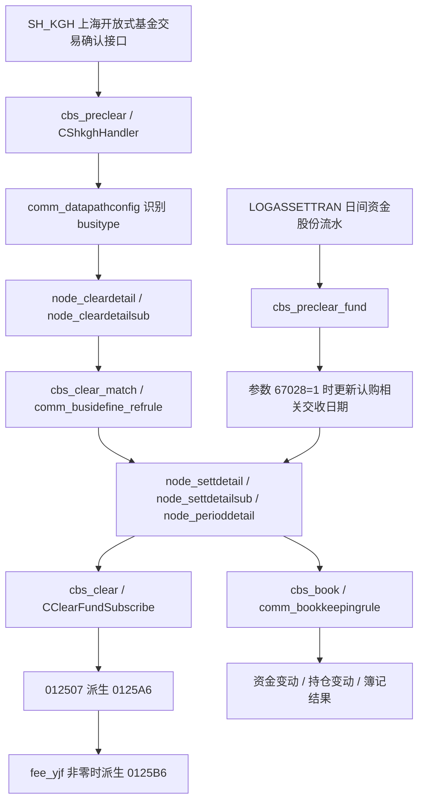
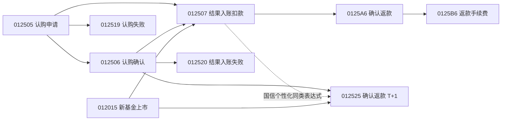

# 上海开放式基金认购业务逻辑说明

## 1. 说明范围

本文说明上海开放式基金认购相关 `0125xx` 业务类型的完整业务链路，覆盖：

- `012505` 上海开放式基金认购申请
- `012506` 上海开放式基金认购确认
- `012507` 上海开放式基金认购结果入账扣款
- `012519` 上海开放式基金认购失败
- `012520` 上海开放式基金认购结果入账失败
- `012525` 上海开放式基金认购确认返款
- `0125A6` 上海开放式基金认购确认返款
- `0125B6` 上海开放式基金认购确认返款(手续费)

本文只说明现有代码和数据库配置体现出的业务逻辑，不引入代码、SQL 或配置变更。`012525` 在当前查询到的基础 `comm_datapathconfig` 中没有直接识别配置；国信个性化配置下，可将原本 `012507` 使用的 `businesscode=130,ReturnCode=0000` 表达式识别为 `012525`，且 KGH 预处理代码对 `012525` 有专门字段赋值逻辑。本文说明该识别差异和已配置下游行为，不展开个性化配置文件的发布来源。

## 2. 资料来源

代码来源：

| 关注点 | 文件 |
|---|---|
| `SH_KGH` 接口转换 | `lbm_pro/macbs/cbs_preclear/preclear/handler/SHJYS/shkgh_handler.h` |
| `SH_KGH` handler 工厂 | `lbm_pro/macbs/cbs_preclear/preclear/handler/base/preclear_handler_factory.h` |
| 清算配对引用规则 | `lbm_pro/macbs/cbs_clear_match/clearmatch/matchhandler/match_period_base.cpp` |
| 清算配对主流程缓存 | `lbm_pro/macbs/cbs_clear_match/clearmatch/clearmatch.cpp` |
| 基金认购清算派生 | `lbm_pro/macbs/cbs_clear/clear_deal/clear_deal/handler/clear_fundsubscribe.cpp` |
| 清算主流程调用基金认购 handler | `lbm_pro/macbs/cbs_clear/clear_deal/clear_deal/clear_deal.cpp` |
| 簿记规则执行 | `lbm_pro/macbs/cbs_book/book_deal/book_base/single_book.cpp` |
| `CheckCurrBusitypeParam` 表达式 | `lbm_pro/macbs/cbs_book/book_deal/book_base/expr_function.cpp` |
| 日间资金流水更新交收日期 | `lbm_pro/macbs/cbs_preclear_fund/preclear_fund/handler/preclear_logassettran_handler.h` |
| 系统参数宏定义 | `library/macbs/include/macbs_dict.h` |
| 业务类型宏定义 | `library/macbs/include/macbs_busitypes.h` |

数据库配置来源：

- `fs_cbs_comm.comm_busidefine`
- `fs_cbs_comm.comm_datapathconfig`
- `fs_cbs_comm.comm_busidefine_refrule`
- `fs_cbs_comm.comm_bookkeepingrule`
- `fs_cbs_comm.comm_busitypesplitcfg`
- `fs_cbs_comm.comm_busitype_param`
- `fs_cbs_comm.sys_param_define`
- `fs_cbs_comm.sys_param_value`
- `fs_cbs_comm.comm_settbody_param`

## 3. 总体流程



主要处理顺序：

1. `cbs_preclear` 读取 `SH_KGH` 接口数据，按 `comm_datapathconfig.busiexplain` 识别 `012505/012506/012507/012519/012520`。
2. `cbs_clear_match` 根据 `comm_busidefine_refrule` 处理清算流水、交割流水、周期流水之间的引用关系。
3. `cbs_clear` 中 `CClearFundSubscribe` 对认购结果入账类流水做返款与手续费拆分，形成 `0125A6/0125B6`。
4. `cbs_book` 根据 `comm_bookkeepingrule` 计算资金和持仓变动。
5. `cbs_preclear_fund` 可在系统参数启用时，根据日间 `LOGASSETTRAN` 资金股份流水更新认购相关交收日期。

## 4. 业务类型总览

| busitype | 业务名称 | 来源 / 角色 | 关键方向与标志 |
|---|---|---|---|
| `012505` | 上海开放式基金认购申请 | `SH_KGH businesscode=020` | `periodflag=1`；申请应付金额 |
| `012506` | 上海开放式基金认购确认 | `SH_KGH businesscode=120,ReturnCode=0000` | `funddirect=M`；资金扣减、在途申购款和申购数量 |
| `012507` | 上海开放式基金认购结果入账扣款 | `SH_KGH businesscode=130,ReturnCode=0000` | `funddirect=M`；结果入账扣款并生成普通持仓 |
| `012519` | 上海开放式基金认购失败 | `SH_KGH businesscode=120,ReturnCode<>0000` | `periodflag=0`；冲回申请应付 |
| `012520` | 上海开放式基金认购结果入账失败 | `SH_KGH businesscode=130,ReturnCode<>0000` | `funddirect=P`；失败返款，可经非担保应收过渡 |
| `012525` | 上海开放式基金认购确认返款 | 国信个性化可将原 `012507` 表达式识别为 `012525`；KGH 预处理有字段特化 | 国信个性；`fundsettspeed=1`；`periodflag=1` |
| `0125A6` | 上海开放式基金认购确认返款 | 清算处理由 `012507` 派生 | `funddirect=P`；返还本金/费用组合 |
| `0125B6` | 上海开放式基金认购确认返款(手续费) | 清算处理由 `0125A6` 手续费拆分 | `funddirect=P`；返还手续费 |

## 5. 预清算识别逻辑

`CShkghHandler::SetBusiTypeByDatapathConfig()` 按以下顺序匹配 `comm_datapathconfig`：

1. `businesscode=<BusinessCode>,ReturnCode=<ReturnCode>`
2. 如果 `ReturnCode != 0000`，再匹配 `businesscode=<BusinessCode>,ReturnCode<>0000`
3. 最后匹配 `businesscode=<BusinessCode>`

目标业务的 `comm_datapathconfig` 配置如下：

| pathid | busiexplain | busitype | matchtype | feecalflag | dealpoint |
|---|---|---|---|---|---|
| `SH_KGH` | `businesscode=020` | `012505` | `0` | `0` | `1` |
| `SH_KGH` | `businesscode=120,ReturnCode=0000` | `012506` | `a` | `9` | `1` |
| `SH_KGH` | `businesscode=130,ReturnCode=0000` | `012507` | `a` | `9` | `1` |
| `SH_KGH` | `businesscode=120,ReturnCode<>0000` | `012519` | `a` | `0` | `1` |
| `SH_KGH` | `businesscode=130,ReturnCode<>0000` | `012520` | `a` | `9` | `1` |

字段落地要点：

- `businesscode=020` 时，代码把证券表 `linkstkid` 写入 `stkid1`，用于后续确认/失败流水通过 `stkid=stkid1` 关联认购申请。
- `businesscode=120` 的认购确认，成交金额按负数处理；若净值为 0，使用行情价格或确认金额兜底计算数量。
- `businesscode=130` 的认购结果入账，成交金额按负数处理，并把 `OtherFee2` 写入 `intramt`。
- `012525` 未在当前查询到的基础 `SH_KGH` `comm_datapathconfig` 中配置直接识别关系。

国信个性化 `012525` 识别与字段差异：

- 基础配置中，`businesscode=130,ReturnCode=0000` 识别为 `012507`。
- 国信个性化配置中，同一类结果入账成功表达式可识别为 `012525`，即 `BUSITYPE_SHJJRGQRFKT1`。
- 一旦 KGH 预处理识别出的业务类型为 `012525`，`CShkghHandler` 会进入专门分支：

| 字段 | `012507` 常规结果入账 | `012525` 国信个性化返款 |
|---|---|---|
| `matchamt` | 按 `ConfirmedAmount` 负向落地 | `ApplicationAmount - ConfirmedAmount`，体现申请金额与确认金额的轧差返款 |
| `confirmedamt` | 按常规确认金额写入 | 使用 `ConfirmedAmount`，代码注释说明确认金额包含代理费 |
| `fee_dlf` | 使用接口代理费字段 | 强制置 `0` |
| `intramt` | `OtherFee2` 写入 `intramt` | 保持结果入账路径的 `OtherFee2 -> intramt` 处理 |

因此，`012525` 与 `012507` 可来自同类 `businesscode=130,ReturnCode=0000` 结果入账成功记录，但国信个性化场景把它解释为 T+1 返款类流水：成交金额不再按确认金额本身表达，而是按申请金额和确认金额轧差表达，确认金额另写 `confirmedamt` 供成本/返款相关处理使用。

## 6. 引用配对关系

`cbs_clear_match` 加载 `comm_busidefine_refrule` 后，按业务类型和 `reftype` 找引用规则。目标链路相关配置如下：

| busitype | reftype | reftargetbusitype | refrule | 业务含义 |
|---|---|---|---|---|
| `012506` | `0` | `012505` | `secuid,mainseat,stkid=stkid1,applycode,orderdate` | 确认关联认购申请 |
| `012507` | `0` | `012505` | `secuid,mainseat,stkid=stkid1,applycode,orderdate` | 结果入账关联认购申请 |
| `012507` | `0` | `012506` | `secuid,mainseat,stkid,applycode,orderdate` | 结果入账关联认购确认 |
| `012507` | `1` | `012506` | `secuid,mainseat,stkid,applycode,orderdate` | 结果入账周期配对关联确认 |
| `012519` | `0` | `012505` | `secuid,mainseat,stkid=stkid1,applycode,orderdate` | 认购失败关联申请 |
| `012520` | `0` | `012506` | `secuid,mainseat,stkid,applycode,orderdate` | 结果入账失败关联确认 |
| `012520` | `1` | `012506` | `secuid,mainseat,stkid,applycode,orderdate` | 结果入账失败周期配对关联确认 |
| `012525` | `0` | `012506` | `secuid,mainseat,stkid,applycode,orderdate` | T+1 返款关联确认 |
| `012525` | `1` | `012506` | `secuid,mainseat,stkid,applycode,orderdate` | T+1 返款周期配对关联确认 |
| `012015` | `0` | `012507` | `market,secuid,mainseat,stkid` | 新基金上市关联认购结果入账 |
| `012015` | `0` | `012525` | `market,secuid,mainseat,stkid` | 新基金上市关联 T+1 返款 |

`012520` 在配对代码中有特殊处理：失败类认购结果如果退款配置字段与子表字段不一致，代码会从关联流水子表中补处理 `orderamt`、`intramt` 等字段，避免退款计算取不到正确金额。

## 7. 清算派生逻辑

### 7.1 `012507 -> 0125A6`

`CClearFundSubscribe::DealOneSettDetail()` 识别 `BUSITYPE_SHJJRGJGRZ`，即 `012507`，会进入 `ClearAddSettdetail()`。

派生逻辑：

1. 读取原 `012507` 的 `refbusiflowid`。
2. 根据 `refbusiflowidsrc` 从 `node_perioddetail` 或 `node_settdetail` 查关联流水。
3. 复制原交割流水生成新流水。
4. 将新流水 `busitype` 改为 `BUSITYPE_SHJJRGQRFK`，即 `0125A6`。
5. 新流水 `createpoint` 置为清算处理生成点，便于重做时清理。
6. `matchamt = ABS(关联流水.matchamt)`。
7. `matchqty = -ABS(关联流水.matchqty)`。
8. 子表中 `matchamt`、`matchqty`、`fee_sxf`、`fee_other` 按关联流水反向生成。
9. 子表中 `fee_yjf` 不直接写入新 `0125A6`，而是取反后传给手续费拆分逻辑。

### 7.2 `0125A6 -> 0125B6`

`splitSettDetail()` 根据传入的 `dbFeeYjf` 判断是否拆出手续费流水：

- `dbFeeYjf == 0`：不生成 `0125B6`。
- `dbFeeYjf != 0`：复制 `0125A6` 生成新流水，`busitype` 改为 `BUSITYPE_SHJJRGQRFK_FEE`，即 `0125B6`。

`0125B6` 字段要点：

| 字段 | 处理 |
|---|---|
| `busitype` | `0125B6` |
| `matchamt` | `dbFeeYjf` |
| `matchqty` | `0` |
| `intramt` | `0` |
| 子表 `matchamt` | `dbFeeYjf` |

当前目标业务在 `comm_busitypesplitcfg` 中没有精确匹配记录，说明 `0125A6/0125B6` 的本链路派生不是由该配置表驱动，而是由 `CClearFundSubscribe` 代码驱动。

## 8. 簿记规则

以下规则来自 `comm_bookkeepingrule`，`accountingdate=0` 表示清算日，`accountingdate=2` 表示资金交收日。

### 8.1 `012505` 认购申请

| 日期 | 科目 | 公式 |
|---|---|---|
| 清算日 | `F300331` 上海基金认申购申请应付金额 | `@orderamt-fee_yjf` |

业务含义：申请阶段形成上海基金认申购申请应付金额。

### 8.2 `012506` 认购确认

| 日期 | 科目 | 公式 |
|---|---|---|
| 清算日 | `F300331` 上海基金认申购申请应付金额 | `-GetRefDetailSub("F300331")` |
| 清算日 | `F100201` 资金余额 | `-(@matchamt+@fee_sxf-fee_yjf+@fee_other)` |
| 清算日 | `S72001` 新股申购款 | `@matchamt+@fee_sxf-fee_yjf+@fee_other` |
| 清算日 | `S10028` 新股申购数量 | `@matchqty` |

业务含义：确认阶段冲回申请应付，同时把确认金额及费用转入资金与在途申购相关科目。

### 8.3 `012507` 认购结果入账扣款

| 日期 | 科目 | 公式 |
|---|---|---|
| 清算日 | `F100201` 资金余额 | `-(@matchamt+@fee_sxf-fee_yjf+@fee_other+@fee_dlf)` |
| 清算日 | `S10001` 普通持仓数量 | `@matchqty` |
| 清算日 | `S61002` 普通成本（费用） | `@matchamt+@fee_sxf-fee_yjf+@fee_other+@fee_dlf` |
| 清算日 | `S62000` 盈亏成本 | `GetPresentChgBal("S61002")` |

业务含义：结果入账扣减资金，确认普通持仓数量和成本。

### 8.4 `012519` 认购失败

| 日期 | 科目 | 公式 |
|---|---|---|
| 清算日 | `F300331` 上海基金认申购申请应付金额 | `-GetRefDetailSub("F300331")` |

业务含义：确认失败时冲回原申请应付金额。

### 8.5 `012520` 认购结果入账失败

| 日期 | 条件 | 科目 | 公式 |
|---|---|---|---|
| 清算日 | `createdate!=fundsettdate` | `F300326` 上海T+N非担保应收金额 | `@orderamt+@intramt` |
| 清算日 | 无 | `S10028` 新股申购数量 | `-GetRefDetailSub("S10028")` |
| 清算日 | 无 | `S72001` 新股申购款 | `-GetRefDetailSub("S72001")` |
| 资金交收日 | `createdate!=fundsettdate` | `F300326` 上海T+N非担保应收金额 | `-@orderamt-@intramt` |
| 资金交收日 | 无 | `F100201` 资金余额 | `@orderamt+@intramt` |

业务含义：结果入账失败时冲回确认阶段的申购数量和申购款；如果创建日和资金交收日不同，先挂非担保应收，资金交收日再转资金余额。

### 8.6 `012525` 认购确认返款

`012525` 是国信个性 T+1 返款型业务。当前基础库查询不到它在 `SH_KGH` 中的直接识别配置；在国信个性化配置中，可将原本 `012507` 的 `businesscode=130,ReturnCode=0000` 结果入账成功表达式识别为 `012525`。识别为 `012525` 后，KGH 预处理会按申请金额与确认金额轧差设置 `matchamt`，将确认金额写入 `confirmedamt`，并把代理费 `fee_dlf` 置为 `0`。

以下说明它的下游配置行为。

| 日期 | 科目 | 公式 |
|---|---|---|
| 清算日 | `F300326` 上海T+N非担保应收金额 | `@matchamt` |
| 清算日 | `S61009` 待上市成本 | `-@matchamt` |
| 清算日 | `S10028` 新股申购数量 | `-GetRefDetailSub("S10028")` |
| 清算日 | `S10004` 待上市数量 | `@matchqty` |
| 资金交收日 | `F300326` 上海T+N非担保应收金额 | `-@matchamt` |
| 资金交收日 | `F100201` 资金余额 | `@matchamt` |

业务含义：`012525` 配置为国信个性 T+1 返款型业务，当日形成非担保应收和待上市相关持仓影响，资金交收日再转资金余额。

### 8.7 `0125A6` 认购确认返款

`0125A6` 的簿记受 `comm_busitype_param` 中当前业务类型参数 `100001` 控制。

| 日期 | 条件 | 科目 | 公式 |
|---|---|---|---|
| 清算日 | `not(CheckCurrBusitypeParam(100001,'1'))` | `F100201` 资金余额 | `@matchamt+@fee_sxf+fee_yjf+@fee_other` |
| 清算日 | `CheckCurrBusitypeParam(100001,'1')` | `F300326` 上海T+N非担保应收金额 | `@matchamt` |
| 清算日 | 无 | `S72001` 新股申购款 | `-GetRefDetailSub("S72001")` |
| 清算日 | 无 | `S10028` 新股申购数量 | `-GetRefDetailSub("S10028")` |
| 资金交收日 | `CheckCurrBusitypeParam(100001,'1')` | `F300326` 上海T+N非担保应收金额 | `-@matchamt` |
| 资金交收日 | `CheckCurrBusitypeParam(100001,'1')` | `F100201` 资金余额 | `@matchamt` |

业务含义：

- 未配置 `comm_busitype_param` 或参数值不为 `1`：返款在清算日直接入资金余额。
- 配置参数 `100001=1`：返款先入非担保应收，资金交收日再转资金余额。

### 8.8 `0125B6` 返款手续费

| 日期 | 科目 | 公式 |
|---|---|---|
| 资金交收日 | `F100201` 资金余额 | `@matchamt` |
| 资金交收日 | `S72001` 新股申购款 | `-@matchamt` |

业务含义：拆出的手续费返款在资金交收日增加资金余额，同时冲减新股申购款。

## 9. 参数分支

### 9.1 `comm_busitype_param` 参数 `100001`

当前数据库中，目标业务 `012505/012506/012507/012519/012520/012525/0125A6/0125B6` 没有 `comm_busitype_param` 记录。

代码中的 `CheckCurrBusitypeParam(100001,'1')` 逻辑为：

- 找不到当前业务类型参数：返回 `0`。
- 找到参数且值等于 `1`：返回 `1`。
- 找到参数但值不等于 `1`：返回 `0`。

对 `0125A6` 的影响：

| 参数状态 | 影响 |
|---|---|
| 未配置 | 走直接资金余额返款分支 |
| 配置但值不是 `1` | 走直接资金余额返款分支 |
| 配置值为 `1` | 走 T+N 非担保应收过渡分支 |

### 9.2 系统参数 `PARAMID_JJRG_SETT_WAY=67028`

`library/macbs/include/macbs_dict.h` 定义：

```cpp
#define PARAMID_JJRG_SETT_WAY 67028
```

含义：基金认购确认和返款是否通过日间流水更新交收日期。

当前数据库情况：

- `sys_param_define` 中未查到 `paramid=67028`。
- `sys_param_value` 中未查到 `paramid=67028` 当前值。
- `comm_settbody_param` 中未查到 `paramid=67028` 当前值。
- 代码读取该参数时默认值为 `'0'`。

参数分支：

| 参数值 | 处理 |
|---|---|
| `0` 或未配置 | 不根据日间 `LOGASSETTRAN` 资金股份流水更新认购相关交收日期 |
| `1` | 当 `LOGASSETTRAN` 识别到上证/开放式 LOF 基金认购相关日间资金流水时，按资金发生额匹配 `012520/012525` 等认购相关交割流水，并更新 `fundsettdate`、`fundrealsettdate`、`archivedate`、`updatedate`，同时置 `daysettflag=1` |

该分支主要影响 `012520` 和 `012525` 等认购失败/返款类流水的真实交收日期维护，不改变 `SH_KGH` 到业务类型的识别关系，也不改变 `CClearFundSubscribe` 的 `0125A6/0125B6` 派生规则。

## 10. `comm_busitypesplitcfg` 结论

当前数据库中，按目标 8 个业务类型精确查询：

- `busitype in (...)` 无记录。
- `busitypesplit in (...)` 无记录。

按 `0125%` 模糊查询时只发现 `012524 -> 012523` 的红利再投拆现金分红配置，与本文认购确认返款链路无直接关系。

因此，本文目标链路中的 `0125A6/0125B6` 派生应按 `CClearFundSubscribe` 代码逻辑理解，不按 `comm_busitypesplitcfg` 标准拆分配置理解。

## 11. 按业务类型串联理解



推荐阅读顺序：

1. 从 `012505` 申请看 `stkid1` 如何建立上市代码关联。
2. 看 `012506` 确认如何冲申请应付并写新股申购款/数量。
3. 看 `012507` 结果入账如何形成普通持仓和成本。
4. 看 `CClearFundSubscribe` 如何从 `012507` 派生 `0125A6`，再按 `fee_yjf` 派生 `0125B6`。
5. 看 `012519/012520` 失败路径如何冲回申请或确认阶段影响。
6. 对 `012525` 结合国信个性化识别配置和 KGH 字段差异理解，再看其下游引用、簿记和交收日期更新。
7. 最后结合 `comm_busitype_param` 和 `PARAMID_JJRG_SETT_WAY=67028` 判断具体部署的资金入账和交收日期分支。
